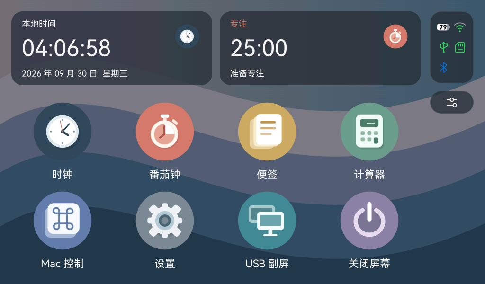
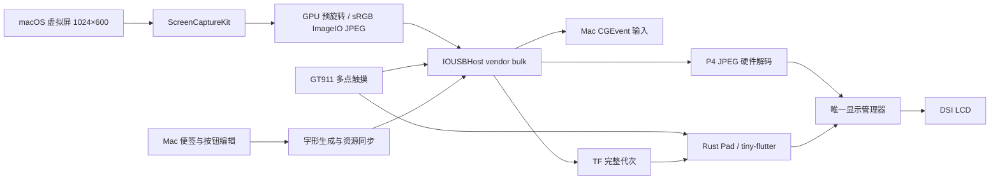

# P4Desk：ESP32-P4 桌面助手与 USB 副屏

适配微雪 **ESP32-P4-WIFI6-Touch-LCD-7B** 的 1024×600 横屏。画面与触摸使用同一板级方向配置，按当前摆放整体校正。设备默认启动 Pad；Mac 配套应用负责编辑便签和快捷按钮、同步字形包，以及创建真正的系统扩展显示器。

UI 基于 [esp32-rust-ui](https://github.com/pomelos-on-sale/esp32-rust-ui) 的 tiny-flutter、tiny_gfx、图标分页桌面、后台应用管理和计算器移植，再加入本项目的本地工具与 Mac 功能。固件采用 C `app_main()` 调用 Rust 静态库，C 层直接驱动 DSI、GT911、SDMMC、USB 与硬件 JPEG 解码。复用范围及首版桌面重写的修正见 [Rust UI 移植说明](docs/rust-ui-port.md)。

## Folio UI 分支

当前 `codex/folio-ui` 将 Folio 风格统一到 Pad 桌面与所有应用：可独立选择深浅配色的四套 SVG 图标、信息卡片、右侧 Dock／状态轨、控制中心及分组页面。设置 → 外观支持深色／浅色切换，以及 Liquid Glass 风格材质的开关和三档效果，选择自动保存。首页时钟显示时分秒，时钟图标同步显示实际指针时间；时钟与番茄钟卡片数字在留白区居中。视觉来源、操作入口、预览与验证记录见 [Folio UI 说明](docs/folio-ui.md) 和 [外观与玻璃材质](docs/appearance-liquid-glass.md)。

## 功能

| 模式 | 功能 |
| --- | --- |
| Pad 本地 | 中文桌面、翻页时钟、番茄钟与倒计时、基本／科学／程序员计算器、便签查看与删除、亮度、Wi-Fi 自动对时和手动校时 |
| Pad 电脑控制 | Mac 编辑的快捷键、应用启动、播放控制、音量和静音按钮 |
| USB 副屏 | 独立 1024×600 macOS 显示器、单指点击和拖动、双指滚动 |

切换应用保留计算器和便签浏览状态，计时服务在后台继续运行。最近应用、仍保留的应用状态及计时进度会自动保存到板载闪存，重启后恢复，倒计时按保存的剩余时间暂停。开机先恢复上次保存的时间并标注“待校准”，没有有效记录时显示“待校时”；连接 Wi-Fi 后自动联网对时，之后每小时更新，也支持 USB 和手动校时。对时状态与“立即对时”位于“设置 → 日期与时间”，详见 [Wi-Fi 对时](docs/wifi-time-sync.md) 和 [断电恢复](docs/power-loss-recovery.md)。进入副屏由用户手动触发；Mac 菜单退出、板上三指长按一秒、断线或主机心跳超时都会返回 Pad。

时钟采用黑底、三张炭灰色大翻页卡片与 DINish Heavy 等宽白色数字，显示 12 小时制及 AM／PM；数字跟随刚性半页绕固定中轴作透视翻转，带角度明暗、软阴影与轻微落稳回弹，日期居中显示。左上角 Home 返回桌面并保留时钟，右上角 × 结束时钟并返回桌面。连接 Mac 自动校时，手动校时位于桌面的设置应用。动画阶段与参考来源见 [翻页时钟动画](docs/flip-clock-animation.md)。

计算器参考 macOS 的深色背景、灰色胶囊按键、橙色运算键与右对齐数字区，支持基本、科学、程序员三个模式。科学模式提供括号、优先级、函数与存储器；程序员模式使用 64 位整数、8／10／16 进制、位运算和可点按的二进制视图。模式与计算状态在回桌面后保留，右上角 × 结束应用。操作、数值边界与三个模式的真实 Rust 预览见 [Pad 计算器](docs/calculator.md)。

番茄钟采用适合横屏的深色简洁布局，中央大数字使用固定宽度数字格，上方切换专注／短休息／长休息，下方显示细进度条和开始／暂停操作。默认 25／5／15 分钟，每完成四次专注准备长休息，下一阶段由用户手动开始；倒计时模式提供 **10 秒、1／5／10／25 分钟**预设。完成动画从底部弹出主题色勾选、圆形扩张铺满，再从中心扩大透明圆形收起；图标与移动边界均去掉白色外框／内框。返回桌面或进入 USB 副屏后继续按单调时钟计时。操作与实际 Rust 渲染预览见 [Pad 番茄钟](docs/pomodoro.md)。

设置采用 macOS 风格的横屏分栏与分组卡片，提供 Wi-Fi、蓝牙、外观、显示器、日期与时间、存储和关于。板载 C6 支持 2.4 GHz Wi-Fi 扫描、触摸键盘连接和保存网络；BLE 支持扫描、连接、主服务查看与 Just Works 配对，同时向手机 BLE 应用广播 P4Desk。功能边界和操作见 [设置与无线连接](docs/settings-wireless.md)，构建、刷机和实际连接验收分别见 [无线验收记录](docs/acceptance-settings-wireless.json)。

Pad 支持在 **设置 → 外观 → 图标主题** 切换 **Folio、Numix Circle、Colloid、WhiteSur** 四套图标，默认 Colloid。图标主题内提供太阳／月亮 Switch（太阳为浅色图标，月亮为深色图标），图标配色独立于系统外观；主题与配色自动保存并在重启后恢复；通用操作图标继续使用原创 SVG，Mac 使用系统 SF Symbols。四套图标编译为 Rust 矢量几何；来源、使用和连续翻页说明见 [图标主题](docs/icon-themes.md)。

桌面沿用原项目的图标槽位和分页框架，按 7 寸横屏排列为 **4 列 × 2 行**，一屏八个入口：时钟、番茄钟、便签、计算器、Mac 控制、设置、USB 副屏、关闭屏幕。原八项保留在第一页，第二页新增“文件管理”“Office”“用量监控”。可以横向滑动或点击底部分页圆点切页；新增应用目前提供可打开的准备页面，接入启动动画、Home／关闭和最近应用记录，文件操作、文档解析和用量数据接入尚未启用。Folio 分支右侧 Dock 显示最近打开过的四个应用，关闭后保留图标；点击时恢复后台实例或重新启动已关闭应用。返回桌面保留实例，后台最多四个，第五个隐藏时关闭最早隐藏的实例；触屏“结束应用”直接释放当前实例。设置中的手动校时子页先返回设置主页。

桌面右上状态板按两列三行均分，每个图标在留有内边距的单元格内居中；依次为电池／Wi-Fi、USB／TF、蓝牙／空位。电池数字内置，状态板只展示；通过下方控制中心按钮查看 Wi-Fi、USB、TF、电池详情及本次启动原因。电池电压来自板载 GPIO20 校准 ADC，百分比为单节锂电电压估算；原生 Type-C 检测到电脑连接时，详情按约定显示“插电充电”，不代表充电实测，充电器和另一 Type-C 插入无法检测。详见 [电池接线与限制](docs/wiring.md#电池状态板载-mx125-接口)。

从桌面打开六个应用及 USB 副屏入口时，SVG 图标保持原位，主题色圆形从点击图标中心扩张铺满屏幕，再从屏幕外侧向中心收起主题色圆形，逐渐露出应用。普通应用完整动作约 940 ms（展开 260 ms、收缩 600 ms）；USB 副屏在全屏主题色阶段等待 Mac 首帧解码后再收缩，成功时直接露出电脑画面，未连接或失败时收起到连接准备页；原生预览与触摸拦截规则见 [应用启动动画](docs/app-launch.md)。

### Pad 预览



预览由同一 Rust UI 在 1024×600 后端渲染，使用演示数据。实机与桌面预览的验收分别记录在 [验收记录](docs/acceptance.md)。

## 快速开始

已经取得交付 ZIP 时，按 [交付包使用](docs/release.md) 直接打开包内 App 和使用固件。以下构建命令在源码项目根目录执行；交付包中的源码需先解压 `P4Desk-0.1.0-source.tar.gz`。

1. 按 [接线说明](docs/wiring.md) 连接供电／串口与 Type-A USB-OTG 高速数据口，保持现有 TF 卡在板载卡槽。
2. 按 [构建说明](docs/build.md) 使用 ESP-IDF **6.0.2** 与 `nightly-2026-09-27` 构建固件。
3. 首次刷写先执行完整 Flash 备份；`device-tool.py flash` 会校验备份后再写入固件。
4. 运行 `scripts/build-macos.sh`，打开 `dist/P4Desk.app`。便签与按钮在“配置”窗口编辑，点击同步后立即在设备生效。
5. 在 Mac 菜单或 Pad 设置中点击进入 USB 副屏。macOS 的屏幕录制权限用于捕获这个虚拟屏，辅助功能权限用于触摸输入和快捷键。

## 项目结构

| 路径 | 内容 |
| --- | --- |
| `crates/tiny-flutter` | 原 Rust 组件／布局引擎，中文字形回退、换行、裁剪、外部事件更新 |
| `crates/tiny-flutter/crates/tiny_gfx` | 原软件栅格绘制引擎 |
| `apps/app-launcher` | 横屏桌面、应用状态、后台计时、便签与配置持久化 |
| `apps/calculator` | tiny-flutter 计算器界面、基本／科学表达式、64 位程序员模式及状态恢复 |
| `crates/p4desk-protocol` | Rust 的 USB v1 协议、快照和字段限制 |
| `common/protocol` | C 的小端帧头与有界分包解析器 |
| `firmware` | ESP-IDF 工程、最小 7B 硬件层、显示管理器、USB、Rust 静态库入口 |
| `desktop/macos` | SwiftUI 菜单栏应用、虚拟显示器、屏幕捕获、USB 与输入桥接 |
| `tools/fontpack` | 生成和校验 P4F1 字形包的 Rust 命令行工具 |
| `assets` | 获准分发的字体、固件内嵌系统字形与自制应用图标 |
| `docs` | 构建、接线、资源存储、协议及验收记录 |

## 架构



视频队列保留正在发送的帧和最新待发送帧；控制消息在完整帧之间优先发送。1024×600 的 JPEG 可能产生 MCU 对齐的 608 行。新会话由 Mac 预旋转可见画面，彩色 JPEG 直接解码到容量为 608 行的 LCD 缓冲，LCD 仍只扫描 600 行；旧主机与灰度帧保留裁切／旋转路径。Pad 和 JPEG 共用同一个面板提交者，按实际 DMA 完成与下一扫描缓冲回收三缓冲。

副屏当前优先清晰度：Mac 使用明确的 sRGB 输入和最高质量 ImageIO baseline JPEG，正常画面保留 4:4:4 完整色度，减少细字和彩色边缘的模糊；单帧超过 1 MiB 时在有限梯度内降低压缩质量。P4 的项目内 JPEG 驱动扩展使用 JFIF 完整范围 BT.601 系数，统一主机与硬件解码颜色转换。RGB565 字节顺序和已确认的画面／触摸方向保持一致；实际画质及帧率见验收记录。

## TF 与数据

TF 资源位于 `/sdcard/p4desk`。支持 FAT32 和 exFAT，挂载失败时保留卡内数据并提示状态。便签、按钮和所需字形以同一完整代次提交；检查 SHA256、字形覆盖和持久化后切换生效，启动恢复最新完整代次。离线删除以稳定 ID 的删除记录合并，重连时不会被旧便签恢复。

详细格式见 [资源与存储](docs/storage-and-fonts.md)、[USB 协议 v1](docs/protocol-v1.md)。

## 检查与交付

本机交付由 `scripts/package-release.py` 生成 `dist/P4Desk-0.1.0.zip`。包内包含签名的 Mac App、固件与 ELF、字形工具／字体、中文说明、许可证、SHA256 清单和对应提交的源码归档。见 [交付包使用](docs/release.md)；构建和实机结果见 [验收记录](docs/acceptance.md)。

```sh
./scripts/test-protocol.sh
./scripts/test-display.sh
./scripts/test-time-sync.sh
cargo test --workspace
swift test --package-path desktop/macos
./scripts/probe-macos.sh
```

本机验收首先针对 Apple Silicon 与 macOS 27.0。虚拟显示器桥接使用私有 CoreGraphics 接口，按个人／小范围自用分发。按当前需求，采集与编码目标提高为 60 FPS；实际有效更新率与回执延迟以 [验收记录](docs/acceptance.md) 为准，光学显示延迟单独验收。

## 来源与许可

- Rust UI：MIT，固定上游提交 `0b75870835902cbf950505d1539dbb8f6e0a7197`。
- 最小板级初始化：微雪 BSP 3.0.1，Apache-2.0。
- TinyUSB：MIT；FatFs 局部覆盖保留 ESP-IDF 6.0.2 和 FatFs 原许可。
- DeskPad 虚拟显示器声明：MIT；系统界面与默认同步字体 HarmonyOS Sans：原 HarmonyOS Sans Fonts License Agreement；先前 Noto Sans SC 及翻页数字 DINish：SIL OFL 1.1。
- 几何图标与界面由项目代码绘制。第三方许可保存在 `third_party/licenses` 与各组件的来源说明中。

参见 [第三方资源清单](docs/third-party.md)。Git 提交使用中文。
