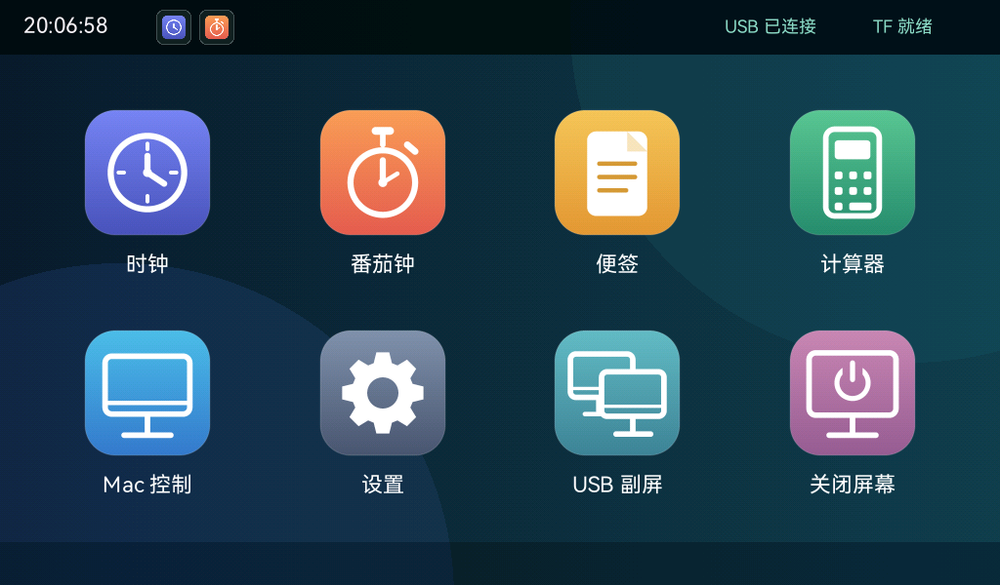

# P4Desk：ESP32-P4 桌面助手与 USB 副屏

适配微雪 **ESP32-P4-WIFI6-Touch-LCD-7B** 的 1024×600 横屏。画面相对首版旋转 180°，触摸坐标同步匹配。设备默认启动 Pad；Mac 配套应用负责编辑便签和快捷按钮、同步字形包，以及创建真正的系统扩展显示器。

UI 从 [esp32-rust-ui](https://github.com/pomelos-on-sale/esp32-rust-ui) 的 tiny-flutter、tiny_gfx、应用桌面和状态管理移植。固件采用 C `app_main()` 调用 Rust 静态库，C 层直接驱动 DSI、GT911、SDMMC、USB 与硬件 JPEG 解码。

## 功能

| 模式 | 功能 |
| --- | --- |
| Pad 本地 | 中文桌面、时钟、番茄钟与倒计时、计算器、便签查看与删除、亮度和手动校时 |
| Pad 电脑控制 | Mac 编辑的快捷键、应用启动、播放控制、音量和静音按钮 |
| USB 副屏 | 独立 1024×600 macOS 显示器、单指点击和拖动、双指滚动 |

切换应用保留计算器和便签浏览状态，计时服务在后台继续运行。开机时间无效时显示“待校时”；连接 Mac 后通过 USB 校时。进入副屏由用户手动触发；Mac 菜单退出、板上三指长按一秒、断线或主机心跳超时都会返回 Pad。

### Pad 预览



预览由同一 Rust UI 在 1024×600 后端渲染，使用演示数据。实机与桌面预览的验收分别记录在 [验收记录](docs/acceptance.md)。

## 快速开始

已经取得交付 ZIP 时，按 [交付包使用](docs/release.md) 直接打开包内 App 和使用固件。以下构建命令在源码项目根目录执行；交付包中的源码需先解压 `P4Desk-0.1.0-source.tar.gz`。

1. 按 [接线说明](docs/wiring.md) 连接供电／串口与 Type-A USB-OTG 高速数据口，保持现有 TF 卡在板载卡槽。
2. 按 [构建说明](docs/build.md) 使用 ESP-IDF **6.0.2** 与 `nightly-2026-09-27` 构建固件。
3. 首次刷写先执行完整 Flash 备份；`device-tool.py flash` 会校验备份后再写入固件。
4. 运行 `scripts/build-macos.sh`，打开 `dist/P4Desk.app`。便签与按钮在“配置”窗口编辑，点击同步后立即在设备生效。
5. 在 Mac 菜单或 Pad 设置中点击进入 USB 副屏。macOS 的屏幕录制权限用于捕获这个虚拟屏，辅助功能权限用于触摸输入和快捷键。

## 项目结构

| 路径 | 内容 |
| --- | --- |
| `crates/tiny-flutter` | 原 Rust 组件／布局引擎，中文字形回退、换行、裁剪、外部事件更新 |
| `crates/tiny-flutter/crates/tiny_gfx` | 原软件栅格绘制引擎 |
| `apps/app-launcher` | 横屏桌面、应用状态、后台计时、便签与配置持久化 |
| `apps/calculator` | 原计算器及状态恢复 |
| `crates/p4desk-protocol` | Rust 的 USB v1 协议、快照和字段限制 |
| `common/protocol` | C 的小端帧头与有界分包解析器 |
| `firmware` | ESP-IDF 工程、最小 7B 硬件层、显示管理器、USB、Rust 静态库入口 |
| `desktop/macos` | SwiftUI 菜单栏应用、虚拟显示器、屏幕捕获、USB 与输入桥接 |
| `tools/fontpack` | 生成和校验 P4F1 字形包的 Rust 命令行工具 |
| `assets` | 获准分发的字体与固件内嵌系统字形 |
| `docs` | 构建、接线、资源存储、协议及验收记录 |

## 架构


视频队列保留正在发送的帧和最新待发送帧；控制消息在完整帧之间优先发送。1024×600 的 JPEG 可能产生 MCU 对齐的 608 行，固件按实际 SOF 信息计算步长并裁剪到 600 行。Pad 和 JPEG 共用同一个面板提交者，按刷新事件回收缓冲。

## TF 与数据

TF 资源位于 `/sdcard/p4desk`。支持 FAT32 和 exFAT，挂载失败时保留卡内数据并提示状态。便签、按钮和所需字形以同一完整代次提交；检查 SHA256、字形覆盖和持久化后切换生效，启动恢复最新完整代次。离线删除以稳定 ID 的删除记录合并，重连时不会被旧便签恢复。

详细格式见 [资源与存储](docs/storage-and-fonts.md)、[USB 协议 v1](docs/protocol-v1.md)。

## 检查与交付

本机交付由 `scripts/package-release.py` 生成 `dist/P4Desk-0.1.0.zip`。包内包含签名的 Mac App、固件与 ELF、字形工具／字体、中文说明、许可证、SHA256 清单和对应提交的源码归档。见 [交付包使用](docs/release.md)；构建和实机结果见 [验收记录](docs/acceptance.md)。

```sh
./scripts/test-protocol.sh
cargo test --workspace
swift test --package-path desktop/macos
./scripts/probe-macos.sh
```

本机验收首先针对 Apple Silicon 与 macOS 27.0。虚拟显示器桥接使用私有 CoreGraphics 接口，按个人／小范围自用分发。30 FPS、有效呈现 ≥25 FPS 和延迟 P95 ≤200 ms 是实机目标，结果以 [验收记录](docs/acceptance.md) 为准。

## 来源与许可

- Rust UI：MIT，固定上游提交 `0b75870835902cbf950505d1539dbb8f6e0a7197`。
- 最小板级初始化：微雪 BSP 3.0.1，Apache-2.0。
- TinyUSB：MIT；FatFs 局部覆盖保留 ESP-IDF 6.0.2 和 FatFs 原许可。
- DeskPad 虚拟显示器声明：MIT；Noto Sans SC：SIL OFL 1.1。
- 几何图标与界面由项目代码绘制。第三方许可保存在 `third_party/licenses` 与各组件的来源说明中。

参见 [第三方资源清单](docs/third-party.md)。Git 提交使用中文。
