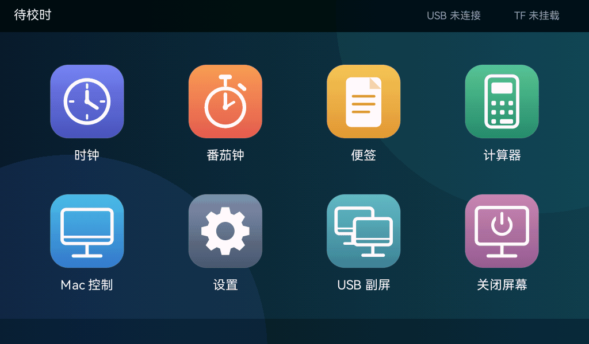
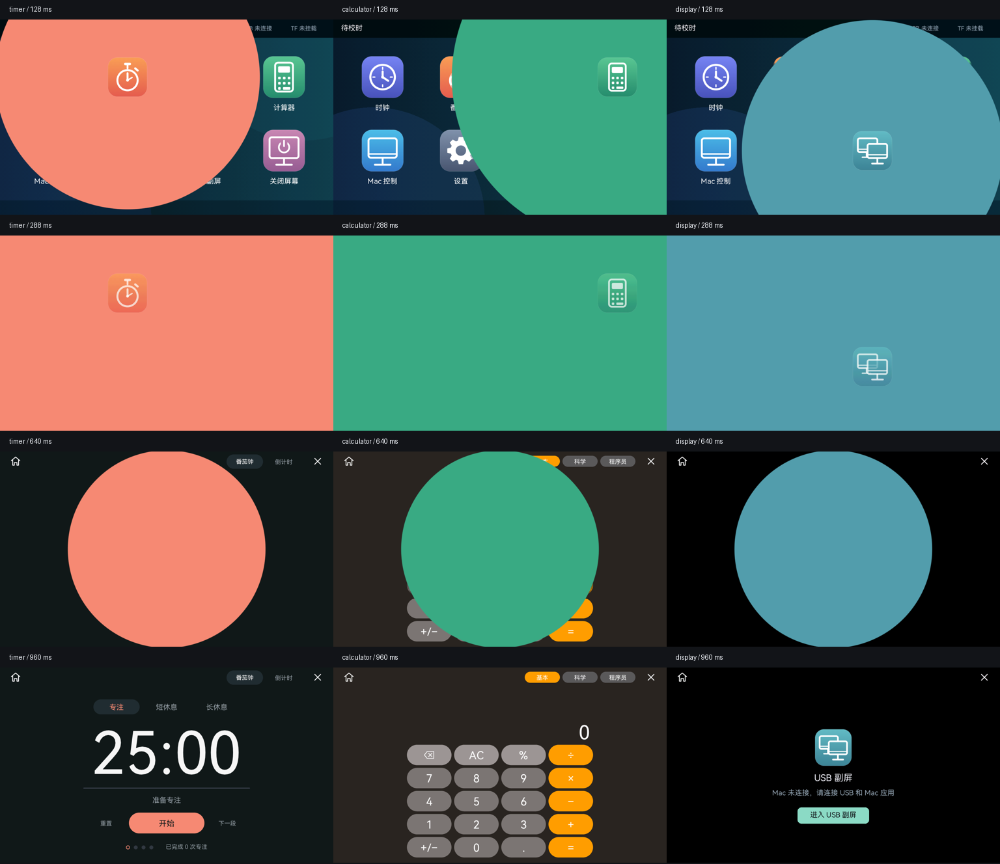

# Pad 应用启动动画

桌面打开时钟、番茄钟、便签、计算器、Mac 控制、设置或 USB 副屏时，保留按下反馈，松手后图标保持原位与大小，主题色圆形从该图标中心向外扩张铺满屏幕；随后主题色圆形从屏幕外侧向中央缩小，应用页面从四周向中间逐渐露出。



## 动作与输入

| 阶段 | 时间 | 画面 |
| --- | --- | --- |
| 原位扩张 | 0～260 ms | 图标位置和大小固定，主题色圆形从图标中心扩张到最远屏幕角落 |
| 全屏过渡 | 260～340 ms | 全屏主题色保持，原位 SVG 图标渐隐 |
| 向内收起 | 340～940 ms | 主题色圆形从屏幕外侧向中心缩小，应用先从四周露出，最后中央颜色消失 |

图标起点从绘制时的全局位置取得，包含分页偏移和 94% 按下缩放；与应用标题／触摸槽分开。SVG 保持松手时的尺寸与位置，轮廓使用覆盖率抗锯齿。启动过程只显示应用图标，不新增标题或说明。圆形复用番茄钟完成动画的窄折射边缘，没有白色内外描边。扩张半径按图标中心到最远角落计算，向内收起则使用屏幕中心，确保两侧和底部完全覆盖、最终无残留。

| 应用 | 主题色 |
| --- | --- |
| 时钟 | 靛蓝 `#626bd8` |
| 番茄钟 | 珊瑚色 `#f18b77` |
| 便签 | 暖黄 `#edb247` |
| 计算器 | 与桌面图标一致的绿色 `#3faa80` |
| Mac 控制 | 蓝色 `#409bdb` |
| 设置 | 灰蓝 `#687c9c` |
| USB 副屏 | 与桌面图标一致的青蓝 `#509faf` |

应用仍在松手时按原状态管理打开：已有计算器和便签实例恢复，计时服务在启动期间继续运行。后台状态栏恢复应用保留原来的直接切换；关闭屏幕仍直接执行。USB 副屏从桌面进入时保留同样的展开与图标渐隐。画面在 340 ms 的全屏青蓝色阶段停住，然后发送一次现有副屏请求。Mac 创建虚拟屏并准备 JPEG 后通过原有 SetMode 握手切换；设备成功解码第一张完整 JPEG 才启动 600 ms 收缩，直接露出电脑画面，不经过连接准备页。

**未连接或创建失败时保留中间页。** 未连接时完整播放 940 ms 动画，收起后停在 USB 副屏准备页，显示连接提示。创建失败、发送失败、等待超时（10 秒）或启动期间断线时，继续收起到该准备页；可手动进入副屏、Home 返回或关闭。重连不自动开启副屏。准备页不进入后台应用列表；成功收缩并完成 LCD 提交后退出该临时页。

启动期间的触摸由覆盖层消费；在启动屏上按住，直到进入应用后才抬起，也不会点击背后的按钮。动画结束后的新手势正常操作。返回、关闭和熄屏会取消未结束的动画；USB 成功进入后的再次返回 Pad 不补播旧启动屏。时钟翻页与计时完成动画只在页面可见后触发。

## 绘制与验证

使用单调时间和 16 ms 的全屏重绘门限，不逐帧修改 revision；结束时提交一次完全干净的应用帧。扩张时复用正常桌面的 RGB565 缓存，首次只修补原图标所在的壁纸区域，再绘制固定位置的 SVG，避免正常尺寸轮廓露出按下后的图标。原缓存分配复用，无新增全屏缓存。缓存不可用时跳过圆形内不透明正方形覆盖的桌面区域，保留折射边缘的原像素。全屏过渡期间图标渐隐，收起期间重绘实际应用；阶段切换即使落在同一个 16 ms 桶内，也会触发绘制。显示提交继续使用原 UI 帧缓冲及唯一 display owner。

## USB 首帧衔接


上图电脑窗口为自制静止测试图，不是实机录屏。先展开并停留在全屏主题色，再以测试图作为底图收缩；离线中间页和完整阶段见 [阶段图](images/pad-usb-direct-stages.png)。

- Rust 动画将进度保持在 340 ms；Mac 的连接、虚拟屏创建、捕获和 SetMode 沿用原协议。
- `display_transition.c` 只管理 arm、epoch 绑定、首张有效 JPEG 的单调时间、收缩与最终 LCD 完成。坏 JPEG、旧 epoch 与等待 Mac 的时间都不会推进动画。
- 唯一 display owner 在 JPEG 解码／PPA 完成后，对独占的 BUILDING 缓冲调用 Rust 同一玻璃圆形绘制器；1024×600 可见区外的 MCU 尾部不参与绘制。对称中心收缩兼容既有 180° 输出。
- 动画期间最多暂存一张已经收到的编码 JPEG（≤1 MiB，转移所有权，不另复制），没有新帧时重复解码后再合成，避免静止画面停在半收缩状态。动画完成、取消或 epoch 变化后释放；不增加全屏像素缓存，展开用桌面缓存到 340 ms 即释放。
- 重绘静止 JPEG 不重复上报 `frame_presented`。真实收到的帧仍按现有 LCD 完成事件上报，包含过渡期主题色覆盖；最终未遮挡帧完成 LCD DMA 后释放过渡状态。
- 副屏过渡中不回传点按／拖动，结束后待全部手指抬起再接受新手势，三指退出仍可用。

验证记录：[USB 首帧衔接验收](acceptance-pad-launch-direct-usb.json)。Rust 测试覆盖长等待、超时、断线、发送失败、设备侧退出、中间页保留、无重复请求以及最终像素／尾部保留；C ASan／UBSan 覆盖首帧启动、600 ms 时长、最终呈现、取消和 10,000 次 epoch 循环，以及原三缓冲所有权和 600／608 行拷贝。主机合成与源码测试不等于实机切换验收。

## 之前圆角矩形版本的启动卡顿优化

用户在首版刷入后确认 10 秒和完成动画去边框正常，但反馈“桌面点击应用到打开有点卡顿”，并询问内存是否足够。当前排查确认有可优化的重复绘制；本轮没有取得当前固件的实板堆采样，不能据此断定内存不足。UART0 日志走板上的串口引脚，当前烧录接口为 USB JTAG，未用空监控输出作为内存证据。

- 壁纸 8×8 Bayer 抖动周期只计算一个八行条带，随后复制到同相位的行；1024 宽时临时缓冲最多 **16 KiB**，函数结束释放。
- SVG 的竖直渐变每行只计算一次颜色和四个抖动相位；覆盖率扫描保留原八次采样，满覆盖区域复用相同贡献值。
- 图标在可见性检查通过后才构造路径；已被启动面板覆盖的桌面区域不再绘制。
- 静止启动屏只提交一次；大数字先取得宽度指标，首次进入番茄钟只栅格化实际需要的数字。

主机 Apple Silicon release 基准，单场景预热后绘制 40 次，以下为中位数；只包含绘制，不含设备 LCD 提交、触摸或 USB：

| 场景 | 优化前 | 优化后 |
| --- | --- | --- |
| 桌面整帧 | 3.908 ms | 1.572 ms |
| 壁纸 | 1.328 ms | 0.299 ms |
| 启动展开 150 ms | 4.257 ms | 0.770 ms |

展开场景临时分配从每帧 **523 次降为 247 次**。第一轮没有增加全屏缓存；16 KiB 行条带属于临时工作空间，累计分配字节数不等同于常驻内存或峰值。以上数据不代表实板帧率。用户随后反馈 **“改善了，但打开时还有卡顿”**，第一轮体验记为需要继续优化。

第一轮优化前后 **207 张**启动、计时和完成动画的 PNG 输出逐字节一致。额外回归对比六个应用位置的裁剪桌面与原整帧桌面，保护圆角、半透明壁纸和文字边缘。全部 183 项 Rust 测试通过。第一轮构建、刷机、基准和实际反馈见 [启动性能验收记录](acceptance-pad-launch-performance.json)。

### 第二轮：复用静止桌面

正常桌面完整重绘完成后，保留一张 **1024×600×2 = 1,228,800 字节（约 1.17 MiB）** 的 RGB565 背景。图标展开期间复用这些像素，只绘制变化的启动面板与当前 SVG 图标，避免每帧重复构造八个图标的路径、覆盖率和渐变。原 SVG 资源与缩放抗锯齿继续使用；缓存只在内存中存在。

缓存使用一次有界分配，后续完整桌面更新复用同一块空间；局部点击反馈和按住时的整帧更新均不会覆盖正常背景。待机轮询保持缓存，启动结束、返回、关闭、直接切换应用、熄屏或进入副屏时释放。回桌面重新准备一张；分配失败则沿用上一轮遮挡裁剪绘制。当前构建的 ESP-IDF 已启用 PSRAM malloc，超过 4 KiB 的分配优先使用 PSRAM；这属于配置与代码检查，当前实板剩余堆仍未采样。

相同 Apple Silicon release 主机基准中，展开 150 ms 场景中位数从上一轮 **0.770 ms 降到 0.235 ms**，临时分配从 **247 降到 68 次／帧**，累计分配字节从 **54,544 降到 5,500 字节／帧**。缓存准备在桌面绘制时完成，不计入这一展开场景；正常桌面更新增加一次 1.17 MiB 的复制。该基准不包含设备提交，也不代表开发板 FPS。

**187 项 Rust workspace 测试通过**。新增验证缓存大小、分配复用、按住时整帧重绘不污染背景、待机后启动、20 次打开／返回释放、自然结束及隐藏取消。六个应用起点的缓存绘制与完整 SVG 背景一致，原来的无缓存回退检查继续保留。与已接受样式的 **207 张 PNG 逐字节一致**。第二轮用户反馈为 **“有所改善，仍有卡顿”**，该版记为继续调整；构建、刷写和反馈分别记录在 [桌面缓存验收记录](acceptance-pad-launch-cache.json)。

### 第三轮：输出、混合与调度

根据第二轮反馈，继续检查每帧绘制后的输出与等待，而非仅减少桌面 SVG 计算。

- 全宽脏区直接借用 Rust 画布的连续 RGB565 行，通过同步 HAL 输出；去掉画布到全屏提取数组的一次复制。初始不再预分配 **1,228,800 字节**提取数组，裁剪列的局部更新才按需申请打包空间。首帧完整绘制同时消费已有脏区，避免下一轮重复整屏绘制。
- 固定颜色与 alpha 的矩形混合使用 **128 项／256 字节**的栈上通道表；每个像素使用精确查询替代重复乘除。所有 RGB565 通道源／目标值与 256 个 alpha、混合 RGB 全词样例逐项对比原公式，保留量化与舍入结果。
- Pad 的可见 **1024×600** 区域由唯一 display owner 使用已有 PPA SRM 客户端复制并旋转 180°。源锁保持到 DMA 完成，目标仅为 BUILDING 缓冲；提交被拒绝时退回 CPU，超时或所有权不确定时沿用停止／复位处理，不提前复用 DMA 缓冲。倍率为 1，不缩放；RGB／字节交换关闭。要求符合 [ESP-IDF 6.0.2 PPA 文档](https://docs.espressif.com/projects/esp-idf/en/v6.0.2/esp32p4/api-reference/peripherals/ppa.html)。
- 主循环以 **16 ms 总预算**计入绘制和处理耗时，只等待剩余时间；较慢的一轮仍至少让出一个 1 ms FreeRTOS tick。启动动画门限由 33 改为 **16 ms，目标约 60 FPS**。880 ms 的动作时序与静止启动屏一次绘制保留；目标调度频率不等于实板已达到的帧率。

**190 项 Rust 测试通过**。新增全宽借用／局部打包及裁剪、resize、begin→flush→end 的输出检查，精确颜色混合回归和预算耗时／最小让出检查。C 显示像素与三缓冲所有权 ASan／UBSan 检查通过。相同时间采样的 **207 张 PNG 逐字节一致**，额外 16 ms 生产路径合成输出 120 张帧。用户已在新版实板确认 **“启动顺畅，点击正常”** 与 **“方向、颜色和触摸都正常”**，启动体验及一般画面／触摸验收通过；实际启动 FPS 与 PPA 执行统计仍未量化。

Apple Silicon release 主机纯绘制基准，淡入 750 ms 场景中位数从第二轮 **1.000 ms 降到 0.706 ms**；该数据不含全宽 HAL 输出或 PPA 提交。完整构建、刷写、来源 Hash 和实机状态见 [输出与调度验收记录](acceptance-pad-launch-pipeline.json)。

## 上一版：原位圆形铺满与向内收起

用户随后要求圆形铺满与中心透明消失，并进一步明确“图标就不用移动了，直接从图标这个位置开始扩散”。用户再明确“消失动画修改成从外部往中间缩”。当前图标固定原位，主题圆形先向外扩张，再从四周向屏幕中心收小直至消失，总时长 880 ms。前述全宽直接输出、桌面缓存、PPA 和预算调度保留；圆形仅使用原有 2 KiB 行缓冲，无新全屏分配。

192 项 Rust workspace 测试通过，覆盖六个桌面起点的图标原位／尺寸、离中心扩张完整覆盖四角、从外向内露出应用、无白边与中心残点、缓存分配复用、20 次打开／返回、跨结束抬起防误触以及后台计时／实例保持。原位扩散轮的番茄钟页面和完成动画 148 张回归 PNG 保持一致；本轮仅调整启动消退方向，前半段扩张／过渡和最终应用的 97 张 PNG 与上一版逐字节一致。当前启动动画按 16 ms 采样输出 120 张预览帧。预览为合成画面，实际流畅度待用户实板确认，证据见 [向内收起启动验收记录](acceptance-pad-launch-inward-circle.json)。


## 当前版本：展开加快、收缩放慢与 USB 入口

按最新反馈，展开从 420 ms 缩短为 **260 ms**，全屏图标淡出仍为 80 ms，向内收缩从 380 ms 延长为 **600 ms**，总长 **940 ms**。保持图标原位、无白边、中心最后消失的行为。计算器启动色使用桌面 SVG 的绿色，不改变计算器页面运算键的颜色。

USB 副屏作为临时准备页接入启动覆盖层。动画完成后发送一次既有 RequestMode 消息，保留 Mac 的权限／捕获准备流程和硬件 SetMode 握手。没有增加协议字段或 LCD 提交者。未连接时不发 USB 消息，显示连接提示；重连后须显式重试，避免意外自动切屏。

验证包括七个图标位置、完整阶段与无残留、延迟且只发送一次副屏请求、返回／关闭／熄屏／断线取消、未连接提示及重试、实际模式必须等主机 SetMode、临时页退出后不保留后台实例。阶段图见下；构建、刷机和实板验收分别记录在 [时序与 USB 入口记录](acceptance-pad-launch-balanced.json)。

用户已在上一版时序调整固件实板确认 **“节奏和颜色都合适”**、**“动画正常，也能进入副屏”**。当前 260 ms 展开／600 ms 收缩、计算器绿色和 USB 入口动画及切换验收通过；这是用户体验与功能反馈，实际帧率和切换耗时尚未量化。




```sh
cargo test -p app-launcher --test app_launch_tests
cargo run --release -p app-launcher --features screenshots --example app-launch-preview -- artifacts/app-launch-balanced-timer 16
python3 scripts/make-timer-completion-preview.py artifacts/app-launch-balanced-timer artifacts/app-launch-balanced-timer.gif --step-ms 16
./scripts/build-firmware.sh
```

GIF 工具需要 Pillow。GIF 循环与额外等待用于展示；普通应用每次打开只执行一次 940 ms 动作；USB 成功路径另包含首帧等待时间。主机像素检查和合成预览不代表设备实测帧率；首版与用户反馈在 [首版记录](acceptance-pad-launch.json)，第一轮优化在 [性能记录](acceptance-pad-launch-performance.json)，第二轮在 [缓存验收记录](acceptance-pad-launch-cache.json)，输出与调度在 [第三轮记录](acceptance-pad-launch-pipeline.json)，向内收起在 [上一版记录](acceptance-pad-launch-inward-circle.json)，时序调整在 [USB 入口记录](acceptance-pad-launch-balanced.json)，当前版本在 [USB 首帧衔接记录](acceptance-pad-launch-direct-usb.json)。

- `apps/app-launcher/src/app_launch.rs`：动画状态、全屏覆盖层、触摸归属、原位圆形扩张和向内收起。
- `apps/app-launcher/src/widgets.rs`：实际图标位置和按下反馈。
- `apps/app-launcher/src/launcher_state.rs`：保留状态的启动入口、隐藏取消与重绘门限。
- `apps/app-launcher/tests/app_launch_tests.rs`：六个起点与图标、全帧一致与最终清理、手势跨结束、后台计时与实例恢复、系统动作和取消。
