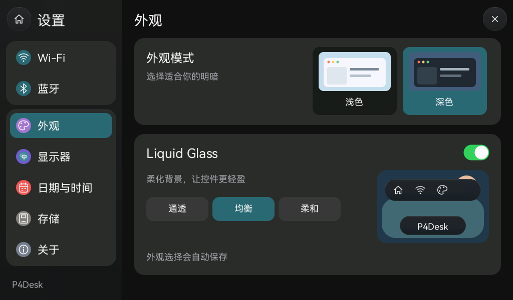
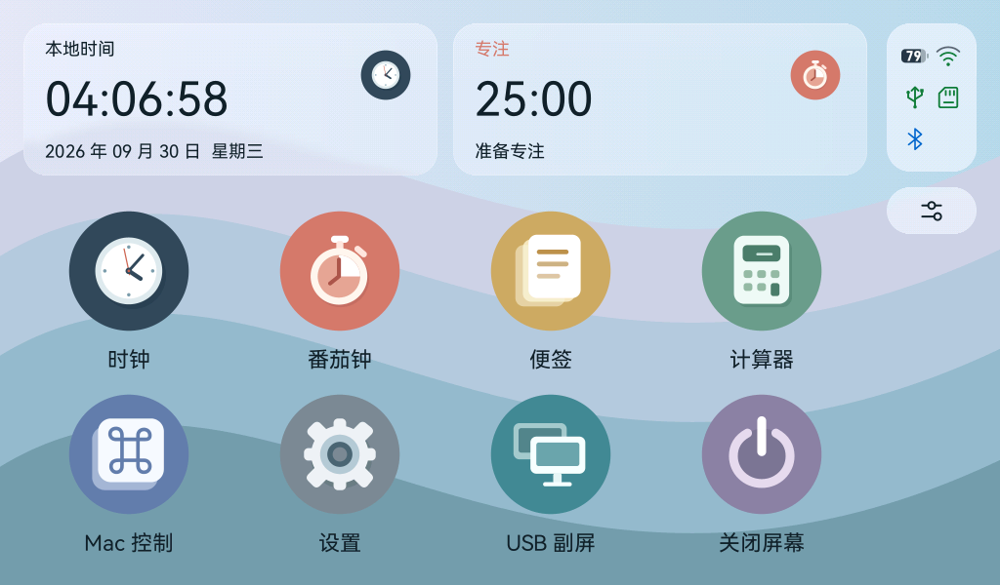
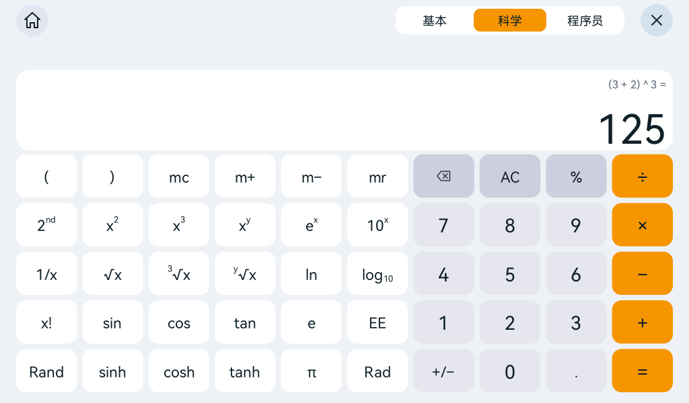

# 深浅外观与 Liquid Glass 风格

## 使用

打开 Pad **设置 → 外观**：

- **浅色／深色**：切换桌面、时钟、番茄钟、计算器三个模式、便签、Mac 控制和设置。USB 副屏传入的电脑画面由 Mac 自己决定外观。
- **Liquid Glass**：可以开关；提供“通透／均衡／柔和”三档，分别使用 25／65／100 的材质混色量。数值越高，控件底色越实，背景越不明显。
- 默认保留深色，玻璃选择“均衡”。外观保存在板载闪存的设置双槽记录中；兼容升级前没有外观字段的记录，不依赖 TF 卡。写入失败时保留原选择并显示错误。
- 桌面不再显示“Mac 未连接，请连接 USB 和 Mac 应用”。USB 状态图标保留；Mac 控制及 USB 副屏的连接说明仍在相应页面显示，其他存储错误继续提示。

## 材质实现与边界

参考 Apple 的 [Materials 指引](https://developer.apple.com/design/human-interface-guidelines/materials) 和 [Liquid Glass 技术概览](https://developer.apple.com/documentation/technologyoverviews/liquid-glass)，将玻璃用于导航、侧栏、状态区、Dock 与悬浮控件，主要内容保持足够对比度。

P4 使用 tiny-flutter / tiny_gfx 的**自定义 Liquid Glass 风格材质**，并非 Apple 平台原生 API。圆角覆盖率抗锯齿、边缘折射、方向性反光、透明着色和按下高光统一由软件栅格器绘制；深浅主题使用不同的前景／表面色。材质源按控件明确区分：应用侧栏和导航只使用当前深浅页面的纯色底，不采样桌面；桌面卡片、状态轨和 Dock 使用预先柔化的壁纸。没有对当前应用文字或 USB 画面实时模糊。

`scripts/generate-glass-backdrops.py` 从项目原创 Folio 壁纸生成两份 256×150 RGB888 资源，每份 115,200 字节。先 4×4 下采样，再做可分离三点滤波；运行时双线性采样、混合和最终 RGB565 有序抖动，减轻低色深条带。首页两个小卡片单独使用曲面材质：降低底色遮盖，增加约 15 px 边缘折射、轻微中心放大、顶部宽高光与下沿反射；右侧状态轨和 Dock 保持柔和材质。高光与按下态共用同一圆角轮廓。采样与抖动坐标锚定屏幕，因此局部重绘与全帧重绘一致，不反复取旧帧造成颜色累积。

材质本身不分配堆内存，也不增加全屏帧缓冲；两份纹理通过 `include_bytes!` 只读访问。应用启动继续复用已存在的桌面缓存。完整桌面重绘仍有额外采样成本，Mac 主机合成计时不代表 ESP32-P4 的实测帧率。

设置侧栏各分组为选中条预留 8 px 内边距（用户已确认圆角和留白正常）；分组圆角 20 px、选中条圆角 14 px，整条位于底板内部，避免圆角交接处露出壁纸。

## 代码入口

| 路径 | 职责 |
| --- | --- |
| `apps/app-launcher/src/appearance.rs` | 应用保存的主题和静态纹理 |
| `crates/tiny-flutter/src/theme.rs` | 隔离到 UI 线程的动态 Folio 调色板 |
| `apps/app-launcher/src/settings_ui.rs` | 外观页面及实际保存命令 |
| `apps/app-launcher/src/storage.rs` | 兼容旧设置与范围校验 |
| `firmware/components/rust_main/src/runtime.rs` | 先保存，再应用外观并清理旧桌面缓存 |
| `crates/tiny-flutter/crates/tiny_gfx/src/material.rs` | 有界软件玻璃绘制 |

## 重现与验证

```sh
python3 scripts/generate-glass-backdrops.py --check
python3 scripts/generate-ui-fonts.py --check
cargo test --workspace
cargo run -p app-launcher --features screenshots --example settings-preview -- artifacts/appearance-dark
cargo run -p app-launcher --features screenshots --example settings-preview -- artifacts/appearance-light light
cargo run -p app-launcher --features screenshots --example folio-preview -- artifacts/appearance-light light
cargo run -p app-launcher --features screenshots --example calculator-preview -- artifacts/appearance-light light
cargo run --release -p app-launcher --example pad-render-benchmark -- 0
cargo run --release -p app-launcher --example pad-render-benchmark -- 65
./scripts/build-firmware.sh
```

测试覆盖设置向后兼容、触摸命令与应用状态保留、实际存储读回与失败保留原选择、应用深浅渲染、桌面提示过滤、玻璃局部重绘一致性、圆角按下态及非法纹理保护，连同现有启动缓存／触摸／计时／计算器回归执行。RGB565 边缘的极低覆盖率可能量化为背景色，因此形状测试用独立圆角几何检查内部与外部，允许一像素抗锯齿过渡区。

以下为**真实 Rust RGB565 渲染的合成数据预览**，不是实机照片。构建、刷机、启动诊断与用户确认分别见 [验收记录](acceptance-appearance.json)。







## 玻璃细化验收

用户确认侧栏圆角和留白正常后，要求应用内不露出桌面，以及增强首页两个小卡片的玻璃感。材质改为每个控件声明 Page／Desktop／DesktopCard，应用与桌面在启动动画同一帧内也各自使用正确的来源；图标擦除与无缓存回退使用相同的卡片材质。使用纯红／纯蓝替换桌面采样源，检查所有应用在深浅主题下逐像素不变、两个桌面卡片仍响应来源变化；另外检查曲面卡片的局部重绘。最新构建、刷机与实机反馈见 [本轮记录](acceptance-glass-refinement.json)。

本次实机反馈已通过：用户确认应用内不再透出桌面，首页两个小卡片玻璃感合适、操作顺畅。
