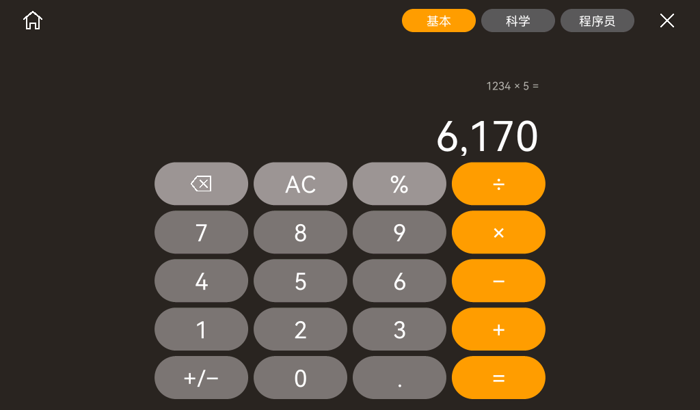
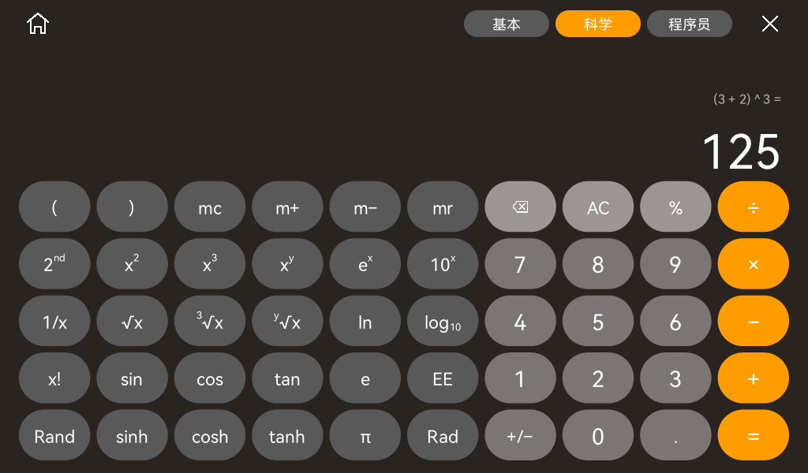
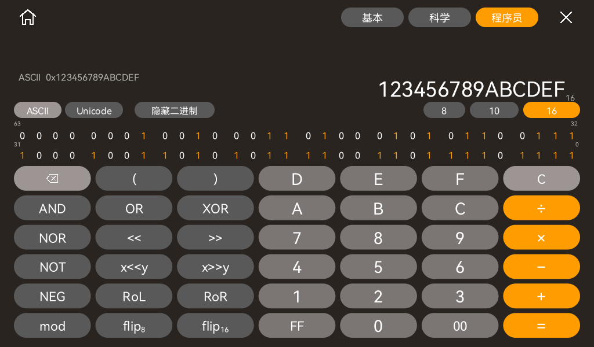

# Pad 计算器

## 外观与入口

参考用户提供的三张 macOS 计算器截图，适配 1024×600 横屏。保留 tiny-flutter / tiny_gfx Rust UI，计算在设备本地完成，C HAL 继续负责 LCD 与触摸。

- 暖灰深色背景 `#292726`；数字键 `#787675`；科学键 `#5b5958`；清除等功能键 `#999796`；运算键 `#ff9f00`。
- 胶囊按键采用边缘覆盖抗锯齿，内部仍按整段填充；通过计算器按钮样式开启。时钟等既有界面保留原绘制路径。
- 普通文字与数字继续使用 HarmonyOS Sans；幂、根与对数的角标分别绘制，退格图标为自制轮廓。
- 左上 Home 返回桌面并保留应用；右上 × 结束应用并重置计算状态。
- 取消左上角应用标题。右上角在 × 左侧依次排列“基本／科学／程序员”，当前模式使用橘黄色 `#ff9f00` 高亮，其余模式为灰色。
- 基本与科学共用浮点状态和存储器；程序员拥有独立整数状态。切换模式和回桌面均保留这些状态，断电后重新初始化。

## 基本模式

四列五行大按键，支持小数、正负号、退格、C／AC、百分比与四则运算。

- `C` 清除正在输入的数，保留表达式；`AC` 清除整个表达式。结果、错误和空输入时显示 AC。
- 所有浮点模式采用乘除高于加减的优先级；科学模式也支持括号及右结合的乘方。
- `100 + 15 % =` 得到 `115`。再输入 `150 =` 得到 `172.5`；连续等号保留最后的运算，百分比保留比例。
- 乘除里的 `%` 将当前输入除以 100。例如 `200 × 10 % =` 得到 `20`。
- 内部采用 f64，显示约 12 位有效数字；继续运算使用内部完整数值。例如 `1 ÷ 3 = × 3 =` 得到 `1`。
- 不能除以零、定义域错误、非有限数值、输入溢出与错误括号均显示具体中文状态。新数字或 AC 可恢复输入。



## 科学模式

十列五行，数字区与基本模式的顺序一致，函数区放在左侧。

| 功能 | 按键 |
| --- | --- |
| 表达式 | `( )`、平方、立方、`xʸ`、平方根、立方根、y 次根、倒数、阶乘 |
| 指数与对数 | `eˣ`、`10ˣ`、`ln`、`log₁₀`；2nd 切换为 `2ˣ`、`log₂` |
| 三角函数 | sin、cos、tan；2nd 切换为 asin、acos、atan |
| 双曲函数 | sinh、cosh、tanh；2nd 切换为 asinh、acosh、atanh |
| 常量与输入 | e、π、Rand、EE 科学计数法 |
| 存储器 | mc 清空、m+ 加入、m− 减去、mr 读出；有存储值时显示 M |

默认角度制。点击 `Rad` 切换为弧度制，按钮变为 `Deg`；再次点击返回角度制。`2nd` 打开时按键提亮，函数标签随之更新。

先输入 `30` 再点击 `sin` 可立即得到 `0.5`；也支持先点 `sin`、输入 `30`、按 `=`。函数前置后接括号时作用于整个括号，例如 `sin (30 + 60) =` 得到 `1`。根运算顺序是被开方数、y 次根键、次数、等号。

`EE` 输入十进制指数，指数的正负号由 `+/−` 切换；例如 `2.5 EE +/− 3 =` 得到 `0.0025`。阶乘限定非负整数 0…170，Rand 为 `[0,1)`。未闭合的括号及尚未填完的指数会提示检查表达式，不会自动补全。表达式最多 128 个 token，单次待执行的前置函数最多 8 个。



## 程序员模式

七列六行，使用固定 64 位二进制补码，不经过 f64 转换。

| 功能 | 行为 |
| --- | --- |
| 8／10／16 进制 | 切换保留同一组 64 位；非法数字禁用；十进制有符号，八／十六进制显示原始位值 |
| 加减乘 | 64 位回绕；键入数字超过所选表示范围时显示“超出范围” |
| 除法／mod | 有符号整数除法向零截断，有符号余数；除零报错 |
| AND／OR／XOR／NOR／NOT／NEG | 64 位逻辑运算和补码取负 |
| `<<`／`>>` | 单次逻辑移位一位，右移补零 |
| `x<<y`／`x>>y` | 输入位数；计数 ≥64 时结果为零 |
| RoL／RoR | 在 64 位字内循环左／右移一位 |
| flip₈ | 每个 16 位单元内交换相邻两个字节 |
| flip₁₆ | 每个 32 位单元内交换相邻两个 16 位单元 |
| FF／00 | 按当前进制追加两个数字；FF 只在十六进制可用 |
| ASCII／Unicode | 显示字符或码点说明；非打印字符、无效 Unicode 标量显示码值。字形使用现有逐字回退，未打包的中文可能显示缺字框 |
| 二进制视图 | 显示 63…32、31…0 两行；位值 1 为橙色；点按单个位直接切换；可以隐藏 |

flip 的具体语义由本项目定义并有固定向量测试：`0123456789ABCDEF` → flip₈ `23016745AB89EFCD`，flip₁₆ `45670123CDEF89AB`。连续按同一个 flip 两次恢复原值。

十进制键入范围为 i64；八进制与十六进制键入范围为 u64。`FFFFFFFFFFFFFFFF` 切换到十进制显示 `-1`。例如 `99 ÷ 10 =` 得到 `9`。



## 构建、预览与验证

```bash
cargo test --workspace
python3 scripts/generate-ui-fonts.py --check
cargo run -p app-launcher --features screenshots --example calculator-preview -- artifacts/calculator-mac
./scripts/build-firmware.sh
```

预览由实际 launcher 和 calculator 组件通过 RGB565 后端生成，演示值来自真正的计算状态，属于主机渲染验证。真实面板外观、三个模式点按与运行响应分别记录在 [验收记录](acceptance.md) 和 [结构化记录](acceptance-calculator.json)。

行为参考：[Apple 基本计算](https://support.apple.com/en-lamr/guide/calculator/calc2c05fe23/12.0/mac/26)、[科学计算](https://support.apple.com/en-lamr/guide/calculator/calcf964141e/12.0/mac/26)、[程序员计算](https://support.apple.com/en-lamr/guide/calculator/calc8990e3ee/12.0/mac/26)。界面按用户截图制作，以上数值边界和位操作以本项目实现为准。
