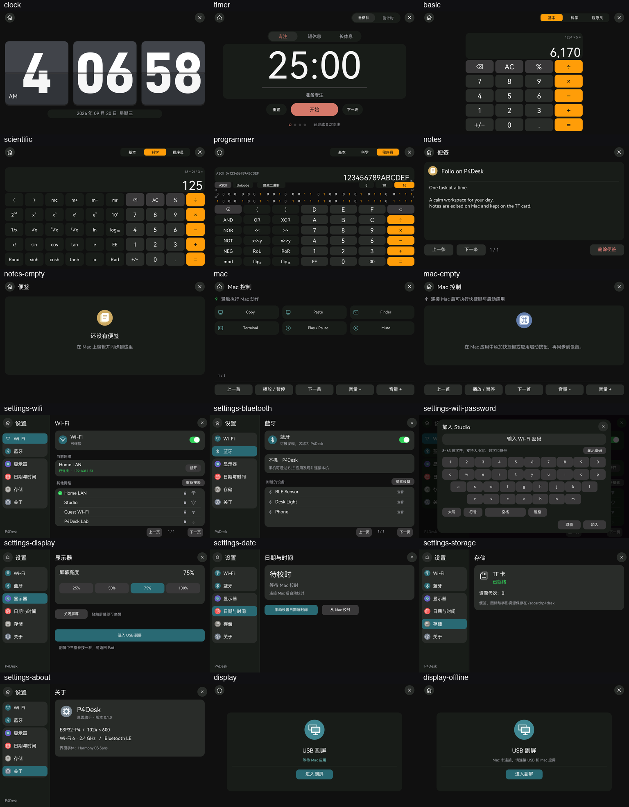
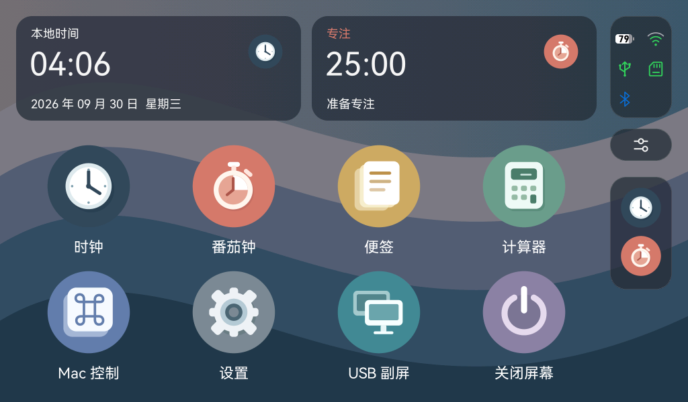
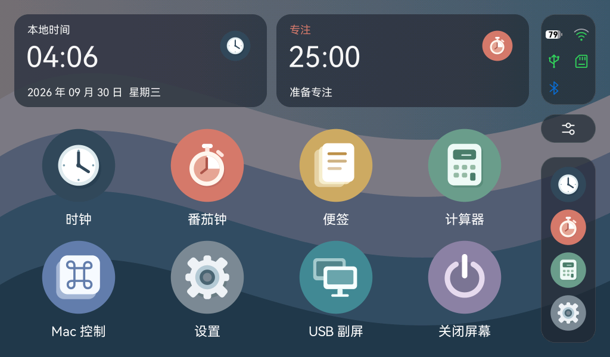
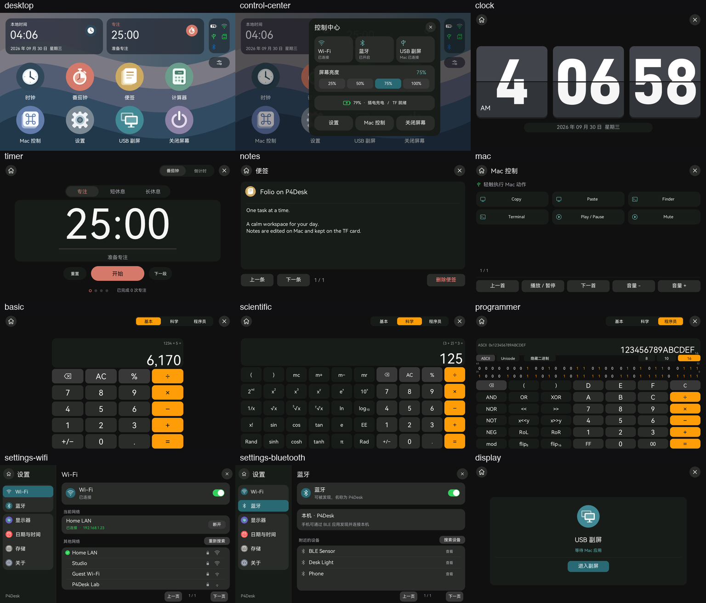

# Folio 风格 Pad UI 分支

分支：`codex/folio-ui`，基于 `main` 的 `87ec66c8375df2cecaeb0a0356ab8d58ac12adf0`。

## 参考与范围

参考 [McCal-Codes/folio](https://github.com/McCal-Codes/folio)，固定提交 `2590bc164aaccaca79dc445272be6c56dff07dc1`。对照 `FolioTokens.kt`、`IosControls.kt`、`StatusRail.kt`、`FolioSheet.kt`、Soft 图标及 SDK 组件图标，将视觉风格适配到 1024×600 的 Rust UI。上游 MIT 原文保存在 `third_party/folio/LICENSE`。

Folio 是 Android Launcher；本分支继续使用 tiny-flutter / tiny_gfx 和 ESP-IDF C HAL。移植范围为 Pad 桌面、全部已有应用页面与系统弹层。Mac 配套应用和 USB 视频内容沿用现有实现。

Folio README 说明其桌面截图使用外部 Minimal O 图标包。本分支八个应用 SVG 由 P4Desk 重画：按用户最终选择采用正圆底板，结合 Folio Soft 的实心符号、浅色叠层和柔和色彩。未打包外部图标包、Folio 截图壁纸或系统商标。SVG 源与生成几何继续使用本项目 MIT 许可。

## 页面与操作

| 位置 | 本分支实现 |
| --- | --- |
| 桌面 | 原创山峦曲线壁纸；顶部直接显示本地时钟／专注卡片，无“今天”或“P4Desk”标题；四列两行八应用，图标画布 140 px，圆底实际直径 122.5 px；内部图形最长边为外圆直径的 60%（73.5 px），等比缩放；卡片点击打开相应应用 |
| 右侧状态轨 | 固定两列：第一行电池／Wi-Fi，第二行 USB／TF，第三行左侧蓝牙；均为 28 px 图标槽，横向电池含端子约 28×14 px；不重复显示时间，整个顶部板块不可点击。电量数字在圆角电池内，采用 DINish Heavy 的原始矢量轮廓；白色填充表示剩余电量、灰色表示剩余空槽；无 `%`、外轮廓或充电闪电。Wi-Fi 未达到的弧线仍灰色，最低档为绿色圆点 |
| 侧边 Dock | 显示本次开机最近打开过的 4 个不同应用，关闭后仍保留图标，图标固定 68 px；按最近一次打开的先后顺序从上往下排列，新打开／重复打开的应用移到末尾，超过 4 个移除最早记录。点击后台应用恢复原实例，点击已关闭应用重新启动；没有打开记录时隐藏图标和底板 |
| 控制中心 | 右侧双滑杆图标打开；真实 Wi-Fi／BLE 开关、USB 入口、25／50／75／100% 亮度、设备详情、设置／Mac 控制／熄屏；外围点按仅关闭面板 |
| 时钟 | 统一导航与深色卡片，保留 DINish Heavy 数字、中轴对齐和机械翻页 |
| 番茄钟／倒计时 | 统一分组面板、选项及主操作；保留 10 秒预设、后台计时和完成动画，动画使用当前按钮主题色 |
| 计算器 | 三种模式均统一为深灰分层、圆角矩形按键与导航；保留橙色运算和模式高亮 |
| 便签／Mac 控制 | 统一 Home／关闭、标题、内容卡片、翻页与动作按钮；便签同步、删除记录和快捷动作契约沿用 |
| 设置 | 深色侧栏、青绿色选中项、分组卡片、绿色开关；覆盖 Wi-Fi、BLE、密码键盘、显示、校时、存储、关于 |
| USB 连接页 | 居中连接卡片与新圆形应用图标；沿用首帧前保持铺色、离线／失败停留连接页的生命周期 |

右侧蓝牙图标显示适配器是否就绪，不代表已经与设备配对；Wi-Fi 图标表示与 AP 的连接及 RSSI，不代表互联网连通性。电量仍为板上电压估算；电池以白／灰填充和黑色数字显示，插电不叠加图标，未知电量显示灰色电池与“--”。“控制中心 → 设备详情”保留 Type-C 假定充电状态与电池电压说明。顶部状态板块无弹层或跳转点击，控制中心按钮保持独立可用。

控制中心按钮的按下层与底板共用 92×48 px 尺寸和 24 px 圆角。按下仅叠加 10% 白色提亮，取消后恢复；避免在胶囊底板内显示另一块小圆角矩形。

最近应用记录与后台实例分开管理，记录只保存静态应用标识，不阻止关闭和内存释放。后台仍最多四个隐藏实例，前台不占这四个名额；第五个实例隐藏时关闭最早隐藏的应用。恢复时先从队列取出目标实例，再隐藏当前应用，防止误淘汰正在恢复的实例。计算器／便签视图关闭时释放，存储的便签不会删除；独立计时服务仍按原规则持续运行。USB 副屏进入最近应用列表，其临时连接页不加入后台队列；关闭屏幕是系统操作，不加入最近列表。打开记录与仍保留的应用实例会自动写入板载闪存，重启后恢复；已关闭的应用只保留最近入口。保存周期、计时暂停策略和无 RTC 时间限制见 [断电恢复](power-loss-recovery.md)。

## 应用内细节适配

对照固定版本上游 `FolioTokens.kt`、`IosControls.kt`、`SettingsGroup.kt` 与 `docs/standards/design.md`，按本板 1024×600 横屏尺寸适配。复用分组卡片、分段选择、细分隔线、强调色和同心圆角的设计规则；固件使用现有 Rust 渲染器绘制。

| 页面 | 细节 |
| --- | --- |
| 共用导航与操作 | Home／关闭统一为 48 px 圆形触控区，内部矢量图标 24 px；按钮按下时在原色上提亮，沿用相同轮廓；面板 24 px、分组 20 px、常规按钮 14 px、内层小控件 10 px 圆角 |
| 翻页时钟 | 保留数字、机械翻页与已确认的卡片亮度；日期改为居中的低对比胶囊，统一导航尺寸 |
| 番茄钟／倒计时 | 顶部模式与时长选项加入分段底板，内外圆角按 4 px 间距对应；重置／下一段使用次级胶囊；开始、暂停和完成状态继续使用当前主题色 |
| 计算器 | 三种模式共用独立结果卡片；键盘按数字／辅助／运算层级区分，禁用键降低对比且按下不高亮；橘色模式选中态和运算键使用深色文字；按下色保留原色相 |
| 便签 | 标题区加入原应用图标与分隔线；标题保留同步字形包支持的 28 px 字号，长标题按真实测量限制两行并加省略号；正文滚动区与底部翻页对齐；删除使用独立危险色，空便签显示图标和说明，不显示无效翻页按钮 |
| Mac 控制 | 连接提示加入 USB 状态图标；快捷键、应用启动和媒体动作有对应类别图标；长标签按实际宽度最多两行；媒体区加入分隔线，仅有多页时显示下一页按钮；空列表显示应用图标和同步说明 |
| 设置 | 侧栏按无线与通用设置分组；Wi-Fi／BLE 列表加入内缩细分隔线和连接标记，点击层与卡片圆角一致；开关采用矢量抗锯齿白色圆形滑块；密码键盘使用分层表单背景；存储及 BLE 提示修正到已有的 22 px 中文字形，避免 20 px 缺字方框 |
| USB 连接 | 图标、标题、状态与主操作分层；状态文字可换行；操作区用分隔线与内容区区分，按钮使用 Folio 填充强调色 |

控件颜色、按下处理和导航样式集中在 `tiny_flutter::theme::Folio`，不新增全屏模糊缓冲。便签和 Mac 标签继续使用同步字形包，不改变资源协议。



## 实现入口

- `crates/tiny-flutter/src/theme.rs`：`Folio` 色板、圆角等共享参数。
- `apps/app-launcher/src/folio_desktop.rs`：桌面布局、信息卡片、Dock；启动图标区域的玻璃底板补绘。
- `apps/app-launcher/src/status_bar.rs`：状态轨、Wi-Fi／电池弹层、控制中心。
- `assets/app_icons/source/*.svg`：八个应用源图标，桌面／Dock／启动动画共用。
- `assets/ui_icons/source/*.svg`：34 个通用图标，统一线条并加入控制中心。
- `apps/app-launcher/examples/folio-preview.rs`：真实 Rust 渲染预览，使用固定演示数据，不写入设备。

## 性能与一致性

图标主体仍为静态 SVG 几何，时钟追加随本地时间变化的矢量指针，按尺寸直接抗锯齿绘制；按钮和分组面板使用已有的圆角覆盖率绘制路径。半透明卡片不做实时高斯模糊，不额外分配全屏模糊缓冲。电池外形、端子和数字均走 8 次纵向覆盖率加横向解析抗锯齿，填充在单个轮廓内完成，避免裁剪交界；11 个 DINish Heavy 数字／横线字形由固定字体的原始轮廓离线生成，保留 SIL OFL 1.1，无运行时字体解析或放大帧缓冲。

原创壁纸的 1024×600 曲线预编译为 50,352 字节抗锯齿横向色带，绘制色带不分配内存；背景渐变仍使用现有的 8 行有界暂存。任意其他尺寸使用矢量路径回退。原启动动画使用一个既有桌面缓存，展开 260 ms、收拢 600 ms；卡片与 Dock 启动时恢复其玻璃背景，避免图标擦除后出现矩形缺口。最近应用栏从 y=264 px 向下排列，图标中心依次为 y=310／382／454／526 px，底板随数量向下延伸；打开应用前快照图标列表，用于动画缓存与无缓存回退，避免最近记录重新排序时使原点或底板跳变。

无线状态轮询仍为 250 ms，新增 BLE 开关和就绪变化的桌面重绘；BLE 扫描列表数量与相同档位 RSSI 噪声不触发额外桌面重绘。

## 重现与验证

```sh
python3 scripts/generate-vector-icons.py --check
swift scripts/generate-battery-vectors.swift --check
python3 scripts/generate-folio-wallpaper.py --check
cargo test --workspace
cargo run -p app-launcher --features screenshots --example folio-preview -- artifacts/folio
cargo run -p app-launcher --features screenshots --example calculator-preview -- artifacts/folio
cargo run -p app-launcher --features screenshots --example settings-preview -- artifacts/folio
cargo run --release -p app-launcher --example pad-render-benchmark
./scripts/build-firmware.sh
```

测试分别覆盖新位置点击、状态板块点击无操作、无打开记录时 Dock 隐藏、最近记录去重和四项上限、关闭后保留图标并重新启动、后台原实例恢复、第五个后台实例释放、满额时恢复最早隐藏应用的状态保护、滑动取消、弹层防穿透、无线／亮度命令、卡片／Dock 原点、局部绘制与全帧一致性、USB 首帧保持和失效恢复。构建、刷机、运行日志与用户视觉验收分别记录在 `docs/acceptance-folio-ui.json`；本机渲染时间不能当作设备帧率。








## 首页时钟与状态区细节

- 时钟卡片显示 `HH:MM:SS`，没有有效时基时显示 `--:--:--`。时钟、番茄钟／倒计时卡片共用按字形实际墨迹上下边界计算的垂直居中，在标题与底部说明之间的 70 px 留白区内摆放数字，不依赖含额外上下留白的字体行高。
- 时钟卡片、桌面应用和右侧最近应用图标显示同一时区的时、分、秒针。时针随分钟、分针随秒数带动；秒针每秒更新。午夜与校时使用与数字相同的新时间。启动动画保留点击时钟面，避免动画中途改变指针。沿用现有按秒刷新，不新增高频动画定时器或帧缓冲。
- 右上状态板仍为 92×152 px，内边距 12 px，内部均分为 2 列 × 3 行（单元格 34×42.67 px），每个图标在其单元格水平、垂直居中。顺序为电池／Wi-Fi、USB／TF、蓝牙／空位。电池 28×14 px 外形和其他图标尺寸保持不变；28 px 图标占位离左右外边框约 15 px。顶部状态板继续仅展示，控制中心按钮继续独立点击。
- 235 项 Rust 测试通过，包括跨午夜时钟、秒针更新、局部裁剪一致性和启动快照；源 SVG 与生成几何可复现。构建、刷机、短时运行和人工验收见 [本次记录](acceptance-folio-desktop-clock.json)。

## 深浅外观与玻璃材质

设置 → 外观可切换整个 Pad 的深色／浅色，并配置 Liquid Glass 风格的通透、均衡、柔和三档或关闭。选择保存在板载闪存中。侧栏与浮动控件使用预过滤壁纸、圆角折射和方向反光，主要内容使用实色背景。桌面不再出现 Mac 未连接的文字横幅；详细实现、边界和预览见 [外观与玻璃材质](appearance-liquid-glass.md)。
