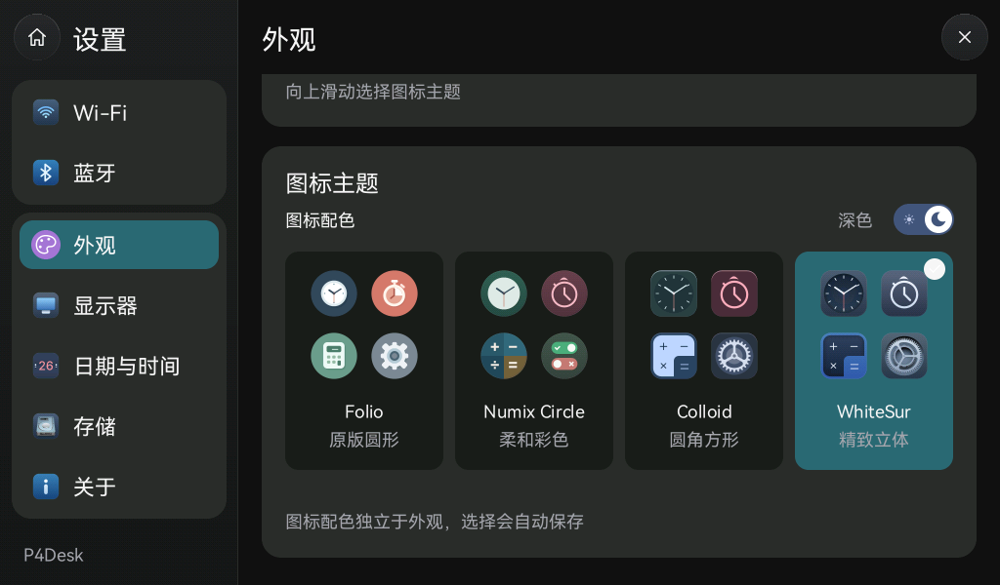
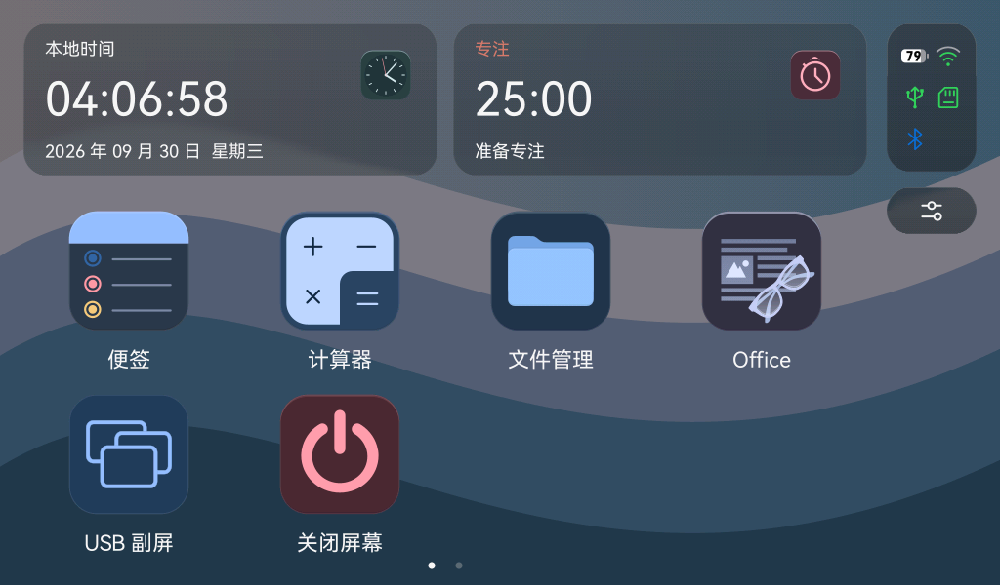

# 四套图标主题与连续翻页

## 使用

打开 **设置 → 外观**，向上滑动右侧内容，在 **图标主题** 中选择。侧栏不再单列“主题”：

| 主题 | 图标形状与来源 | 图标配色 |
| --- | --- | --- |
| Folio | 原创圆形，保留此前内图形比例；补齐文件管理、Office、用量监控 | 原创深色底板及新增浅色底板，内部图形保持原比例 |
| Numix Circle | 用户指定的圆形 SVG | 使用对应深浅图标 |
| Colloid | 用户提供的圆角方形 SVG | 使用对应深浅图标 |
| WhiteSur | 用户新提供的立体圆角 SVG，保留多段与径向渐变 | 使用对应深浅图标 |

初始默认 Colloid。没有 `icon_theme` 字段的旧设置也迁移为 Colloid。点击选择后走现有 Flash 设置双槽校验日志，写入成功再更新界面；写入失败保留之前的选择与数据。主题与系统深浅外观、Liquid Glass 强度独立。

**太阳／月亮 Switch** 位于四张主题预览卡上方，与上方 Liquid Glass、Wi-Fi 开关共用 62×32 像素外框、28 像素圆形拨钮和 72×48 像素触控区，右侧统一对齐：左侧太阳使用浅色图标，右侧月亮使用深色图标。白色圆形拨钮内显示当前图标，旁边文字显示当前配色；太阳和月亮使用原创抗锯齿 SVG。点按后自动保存。浅色界面可以使用深色图标，深色界面也可以使用浅色图标。修改系统外观不会覆盖已选择的图标配色。旧设置缺少 `icon_light_override` 时先保留此前外观对应的配色，之后首次改外观时固定该配色；无需重新选择主题。

从开关上开始纵向滚动会取消本次点按，避免滚动时误切换配色。

外观页的静态内容使用一次绘制、纵向移位的 RGB565 缓存，上下滚动无需按每个新位置重新绘制所有 SVG 与玻璃预览。当前 732×940 内容约占 1.31 MiB，每个启用缓存的滚动控制器上限 2 MiB；外观、图标配色、主题、玻璃强度或内容尺寸变化时替换旧缓存。首开或改变外观需要重新生成一次；分配失败回退原绘制路径。手指滑出内容区仍继续跟随，滚动超过阈值后取消按钮点按；按下时只刷新对应按钮。

连续滚动使用精确的视口刷新范围，不透明缓存直接覆盖像素，跳过下层清屏和背景；位于上层的提示仍按原顺序绘制。P4 输出按帧缓冲原行距借用数据，省去临时打包，保持唯一 LCD 提交者与同步缓冲生命周期。

四张预览卡的时钟固定显示 **10:09:30**。这是预览专用时间；桌面和应用继续使用真实时间。上一版保存的 `Theme` 设置子页自动映射到 `Appearance`，不会使旧会话恢复失败。

桌面、两个卡片、最近应用、设置分类和启动动画使用同一主题。实时钟面指针按各套钟面大小适配；按下反馈跟随圆形或圆角方形外轮廓。USB 显示线程通过一个原子快照同时取得图标主题与图标配色，首帧收缩期间不读取 UI 线程的局部调色板。

## 翻页与性能

- 前后两页连续跟手移动，壁纸和顶部卡片保持原位。
- 松手后按已移动的位置吸附；超过半页进入相邻页，未超过则返回本页，根据剩余距离在 140–210 ms 内收稳，曲线接续松手速度且不越过目标位置。
- 移动超过 8 px 取消原图标按下；即使末次采样直接是松手，位移也不会被误当成点击。
- Rust 每帧可连续处理合并后的移动点，到 Down／Up／Cancel 边界结束；起滑不再为旧阈值点额外等待一帧。
- 松手动画保持当前渲染树，仅重绘图标网格，结束时更新页码与启动背景缓存。回弹中可重新按住；边界阻尼反算后继续拖动，不会二次压缩位置。
- C 触摸队列保留 Down、首次越过点击阈值、最新 Move、Up／Cancel；合并中间移动点。连续 500 个移动采样不会排队逐点回放，也不会将滑出再回到原位变成点击。
- 四套主题共享 6 MiB 的静态图形／壁纸／玻璃像素缓存上限；透明分页缓存另有 4 MiB 上限，按实际占用缓存主题／外观组合，超限时淘汰旧项。
- 透明分页缓存首次绘制生成，有冷启动成本。缓存按扫描行仅保存非透明区域，滑动期间合成已缓存的图标和文字，实时指针单独绘制；静止后恢复原矢量绘制。分配失败回退到原绘制路径。
- 控制中心从真实桌面截取并模糊背景，关闭时释放；桌面两张卡片和控制中心高光改为宽而连续的柔和渐变。

三个新增应用仍为“功能准备中”入口。文件操作、Office 文档解析与用量数据接入不在本次交付中。

## 验证

测试、固件、刷写与实机观察分开记录于 [初版](acceptance-icon-themes.json) 和 [外观合并与跟手修正](acceptance-appearance-theme-refinement.json)。初版用户确认主题切换正常，但反馈翻页不够跟手；不能把初版性能标记为通过。本机渲染耗时用于比较代码路径，不代表开发板帧率。

本轮 WhiteSur、独立配色与滑动修正记录见 [验收记录](acceptance-whitesur-swipe.json)。
