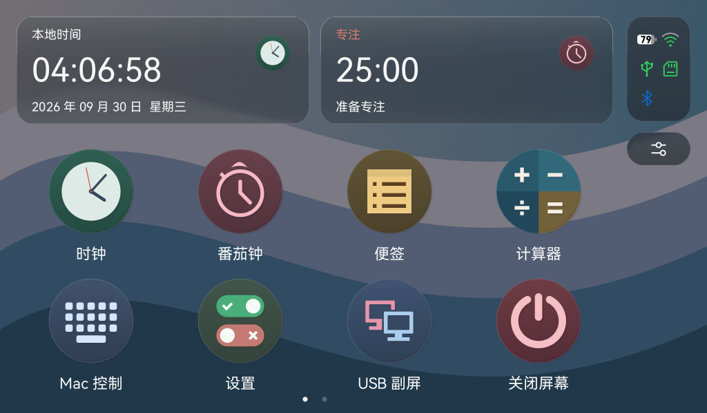
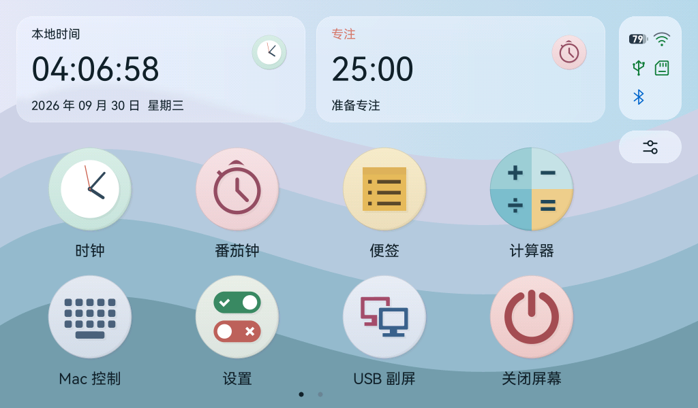
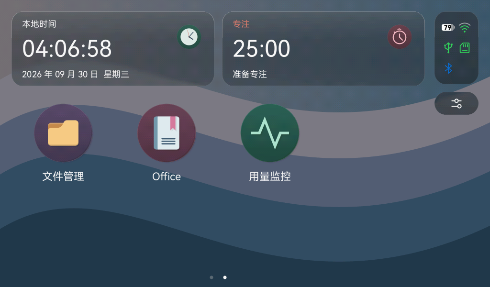

# Numix 深浅图标与三个新入口

## 使用方法

- 在“设置 → 外观”切换深色／浅色，桌面、最近应用 Dock、小卡片和设置分类同步使用对应的 Numix Circle SVG。
- 第一页保留原有 8 个图标，第二页放置“文件管理”“Office”“用量监控”。在应用网格横向滑动，或点击底部页码圆点换页。
- 三个新入口已接入点击反馈、主题色展开与收缩、Home 返回、关闭、最近应用和会话保存。页面显示“功能准备中”：本次只建立入口，尚未实现文件操作、Office 文档解析或用量服务连接。
- 时钟图标继续显示当前时间。状态区的 Wi-Fi 信号分级、电池数字等实时状态图形，以及 Home／关闭等通用操作图标保留原逻辑。

## 渲染预览

以下为实际 Rust RGB565 渲染的合成场景，不是开发板拍摄照片。

### 深色桌面



### 浅色桌面



### 新增入口



## 资源与实现

用户提供的 `P4Desk精选` 包含深浅两套 SVG。本项目选用每套 21 个：8 个原有桌面图标、3 个新增入口、10 个设置图标。每套 4 个备选图标未选用；现有设置页使用其中对应的分类图标，其余随资源保留。

- 原始 SVG、清单和完整许可：`third_party/numix-p4desk/`。
- 规范化 SVG：`assets/numix/{dark,light}/`。
- 资源哈希与输出清单：`assets/numix-icons.json`。
- 生成静态几何：`crates/tiny-flutter/src/graphics/numix_icons_generated.rs`。
- 主题映射：`apps/app-launcher/src/app_icons.rs`。
- 新入口：`apps/app-launcher/src/planned_apps.rs`。

资源保持矢量，构建时展开路径、变换、弧线和当前源图标使用的渐变，设备端仍由 tiny_gfx 抗锯齿绘制。时钟去除源文件中的固定指针和对应阴影，再绘制实时指针。完整圆形曲线转换为现有圆形绘制路径，减少通用路径开销。启动过渡继续使用桌面缓存；USB 首帧收缩显式传递外观，避免显示线程使用错误主题色。

Numix SVG 及派生几何遵循 **GPL-3.0-or-later**，完整许可证随原文件和生成资源保留。来源与修改说明见 [第三方许可](third-party.md)。

## 重新生成

正常 Rust／固件构建直接使用已生成的静态资源。修改 Numix SVG 后运行：

```sh
python3 -m venv .cache/svg-tools
.cache/svg-tools/bin/python -m pip install -r scripts/requirements-svg.txt
.cache/svg-tools/bin/python scripts/generate-numix-icons.py
.cache/svg-tools/bin/python scripts/generate-numix-icons.py --check
python3 scripts/generate-ui-fonts.py --check
cargo test --workspace
./scripts/build-firmware.sh
```

转换器只覆盖当前固定资源使用的 SVG 子集；未知元素或不支持的渐变会报错，不静默忽略。原始 SVG 修改后需同时明确更新来源清单，生成器先检查 SHA256。

## 验证状态

- **构建**：ESP-IDF 6.0.2、Rust nightly-2026-09-27；固件 5,019,632 字节，应用分区余量约 40%。
- **测试**：Rust workspace 260 项通过；42 个矢量资源和中文字体可复现检查通过。新增测试覆盖真实翻页点击、三个入口生命周期／会话恢复、深浅映射与多个图标尺寸、USB 显示线程的显式主题色。
- **预览**：深浅桌面、第二页、新入口和设置页已检查。
- **性能边界**：主机 arm64 合成绘制中完整桌面中位数约 9.04 ms，缓存展开帧约 0.90／0.86 ms。新 SVG 比原图形更复杂，此结果只描述主机渲染开销，不代表 P4 帧率或实屏流畅度。
- **刷机与实机**：初版已刷入，用户确认“深浅图标都合适”，同时反馈左右滑动卡顿。图标外观已通过，性能继续修复。分阶段结果见 [结构化记录](acceptance-numix-icons.json) 和 [性能优化](numix-performance.md)。
