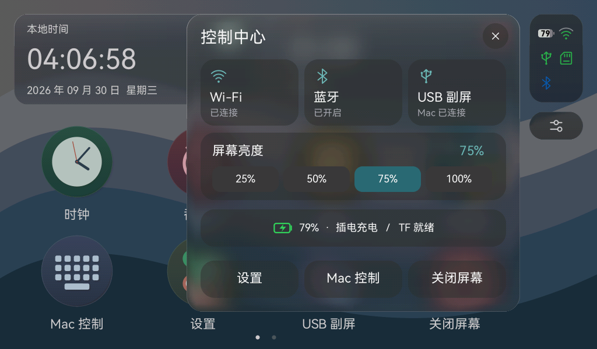
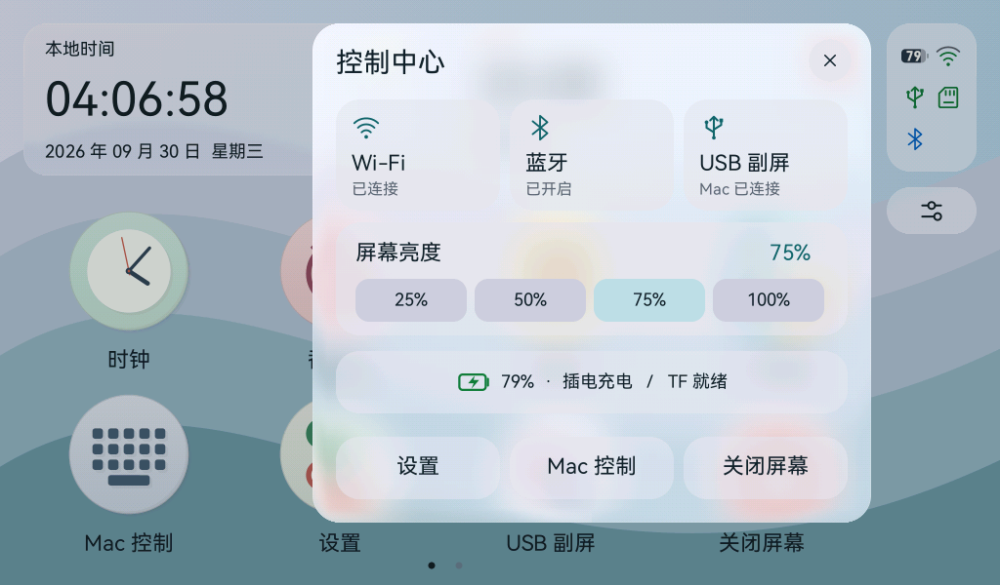

# Numix 图标接入后的 Pad 性能优化

## 用户反馈与定位

用户确认深浅两套图标外观合适，但左右滑动卡顿，并要求优化整体性能。

初版启动日志的 PSRAM 空闲约 18.3 MB，没有发现内存耗尽证据。源码和主机绘制基准显示：复杂 SVG 在每次绘制时重复创建路径、展平曲线、建立渐变与扫描线；不带平移的分页已完成换页后，后续移动采样仍让整个网格重复绘制。

## 修改

1. **静态图标缓存**：仍保留 SVG 与生成的矢量几何。第一次绘制时缓存该区域绘制前后的 RGB565；以后仅在几何、尺寸、位置、颜色以及底下的像素完全一致时复用。局部刷新可复用包含该区域的缓存，新的背景或更大的裁剪区域重新绘制。
2. **限制占用**：第一轮图标缓存为 96 项／2 MiB。第二轮增加壁纸和玻璃面板缓存后，统一限制为每个绘制线程最多 128 项、缓存像素容量最多 **6 MiB**，淘汰最久未使用项。内存申请失败使用原绘制。变换缩放、非整数裁剪和动态透明度使用原路径。缓存不替换源 SVG。
3. **保留动态内容**：时钟只缓存表盘，指针继续按当前时间绘制；深浅主题使用不同源几何，玻璃背景变化会使不匹配缓存失效。
4. **减少手势刷新**：分页完成后仍持续持有手势，避免误开应用；如果后续移动不再改变画面，则返回空的刷新范围，不再输出相同网格。释放时仍正常完成页码与界面状态更新。
5. **实机诊断**：每 30 秒汇总实际绘制帧数、绘制平均／最大耗时、输出耗时，以及图标缓存条数／字节和命中数。日志不含像素、输入内容或凭据。该统计不是把静止页面当作连续视频计算 FPS。

## 主机测量

在同一 arm64 release 渲染例程、40 次样本和均衡玻璃参数下：

| 场景 | 初版中位数 | 优化后中位数 |
| --- | ---: | ---: |
| 完整桌面，缓存热身后 | 9.04 ms | 2.94 ms |
| 启动展开 150 ms 位置 | 0.90 ms | 0.25 ms |
| 启动展开 220 ms 位置 | 0.86 ms | 0.20 ms |
| 启动透明过渡 300 ms 位置 | 0.74 ms | 0.61 ms |
| 收缩显示应用 640 ms 位置 | 0.59 ms | 0.55 ms |

完整桌面的每次绘制分配从 1,794 次／418,210 字节降为 8 次／16,734 字节。这是分配流量，不是常驻内存。两次样本在不同时间执行，指标用于说明缓存路径和开销变化，不能直接当作 P4 的提升比例、帧率或端到端延迟；首次冷绘制仍需要计算 SVG。

原始数据：`.cache/folio/bench-numix-optimized.json` 和 `.cache/folio/bench-perf-cache-final.json`。

## 验证

- 新增缓存测试覆盖两套共 42 个图标，重复绘制、底色变化、分区刷新、分区预热后完整刷新、分数坐标和变换回退，与直接矢量绘制逐像素一致。
- 缓存压力测试确认容量和条数上限；真实桌面触摸测试确认一次换页后的多个移动采样不再触发输出，并且不会打开应用。
- **264 项 workspace 测试通过**，包含已有点击反馈、启动缓存、时钟、计时器、计算器、外观和持久化回归。图标复现检查及 `git diff --check` 通过。
- ESP-IDF **6.0.2** 固件构建通过，5,025,600 字节，SHA256 `07c07cb1cb5e9cea7ee09ade7dc7d2b558f4409b543dbfd4a7a4c75ce669b1f9`。完整备份复核后刷写，三个镜像 Hash 校验通过并复位。
- 实机启动观察和操作反馈单独记录在 [结构化证据](acceptance-numix-performance.json)。
- 本轮针对 UI 渲染和触摸刷新，不改变 USB 视频协议、JPEG 编解码或文件保存语义。图标外观沿用用户已确认版本，最终性能体验仍以开发板上的操作反馈为准。

## 第二轮：静态材质与控制中心毛玻璃

用户反馈第一轮“有改善，但仍会卡顿”，并指出控制中心没有毛玻璃效果。实机第一轮记录显示，交互窗口 111 帧的平均绘制为 191.97 ms，输出为 14.88 ms；后一个窗口的绘制平均 332.94 ms。图标缓存有持续命中，剩余主要绘制开销来自尚未缓存的静态材质。

- 对静态壁纸和玻璃面板复用精确绘制结果。不透明壁纸无需读取旧底色；圆角玻璃验证底下像素后复用，主题、材质强度、位置、尺寸、背景源改变会重新绘制。缓存总像素预算 6 MiB，不增加固件内嵌全屏位图。
- 主机相同例程中，缓存热身后的完整桌面中位数 **0.109 ms**，壁纸 **0.015 ms**，完整桌面每次分配 7 次／350 字节。此为主机绘制数据，不能推导实机帧率。
- 控制中心改用实际桌面快照，在 1/4 分辨率上两轮分离式盒式模糊，再绘制圆角、折射和高光；背景包含当时的图标和卡片。每次打开只采样一次，面板打开期间桌面视觉冻结，计时和后台服务继续运行，控件状态正常刷新。关闭后释放约 1.34 MB 的 RGB565／模糊源快照；再次打开重新取当前桌面。
- 控制中心的按钮和分组改成半透明填充，普通应用页面仍只使用自己的底色，不采样桌面。关闭 Liquid Glass 时面板使用实色。
- 新增静态玻璃深浅／强度／按压／裁剪精确比对、壁纸精确比对、模糊细节和平坦颜色测试，以及控制中心快照复用、关闭释放、换页重开重新采样测试。**268 项 workspace 测试通过**。

以上为 Rust 合成预览，实机结果见 [第二轮记录](acceptance-surface-control.json)。
