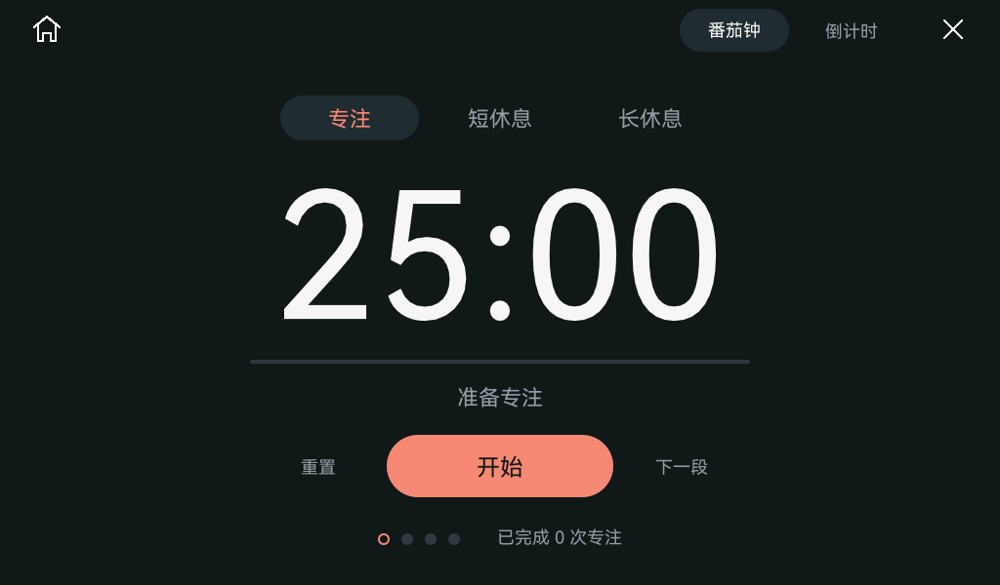
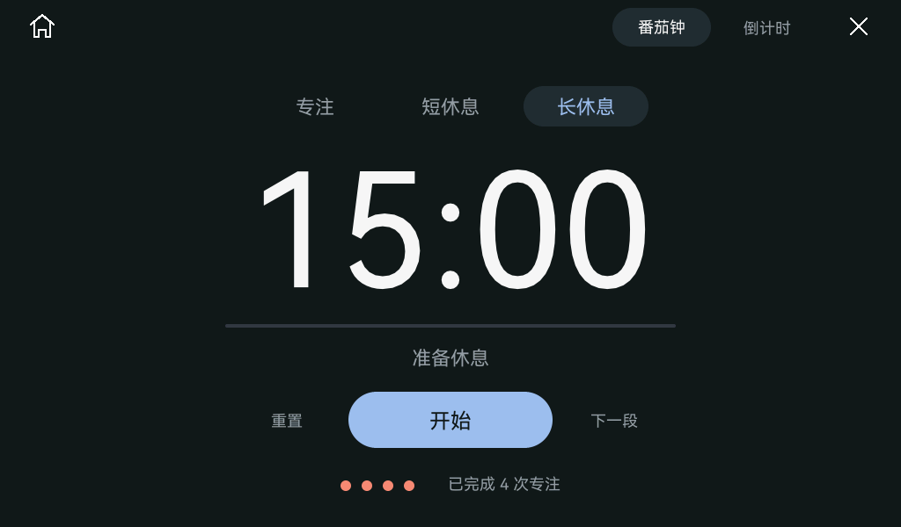
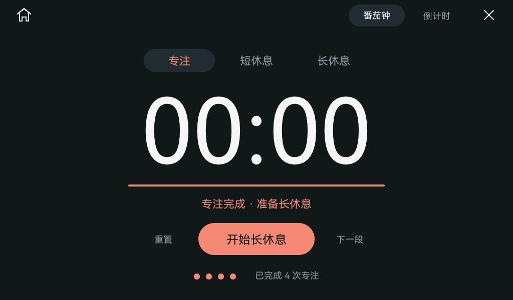
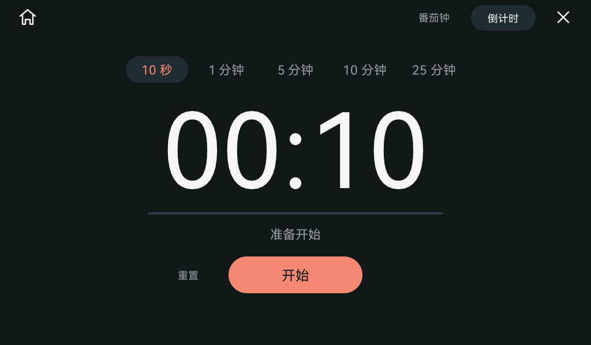
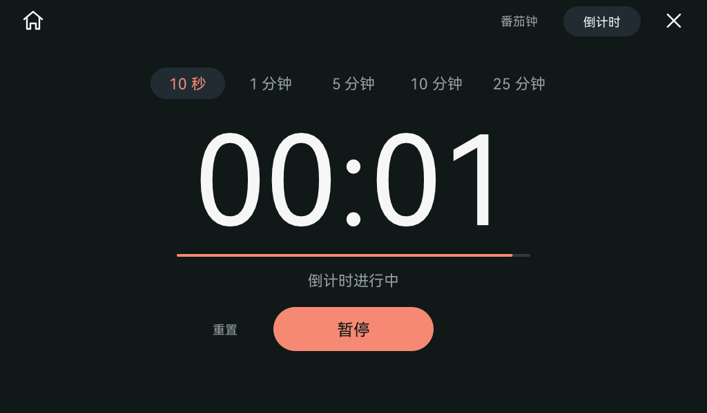

# Pad 番茄钟

## 界面

针对 1024×600 横屏，采用深色背景、中央大数字、阶段切换与一个突出的开始／暂停按钮。左上 Home 返回桌面，右上放番茄钟／倒计时模式与 ×。数字按固定宽度格绘制，每秒变化时保持位置稳定；系统文字与大数字沿用 HarmonyOS Sans。胶囊按钮、细进度条和轮次圆点使用覆盖率抗锯齿。

专注阶段使用珊瑚橙色，短休息使用柔和绿色，长休息使用浅蓝色；只在选中阶段、主按钮、进度和完成状态使用强调色。页内直接显示准备、计时、暂停或完成状态。



交互结构参考 [Pomofocus](https://pomofocus.io/) 的阶段切换、大倒计时和主操作按钮；完整周期与单段倒计时参考 [Flocus 的计时模式说明](https://help.flocus.com/en/articles/10246933-customizing-your-focus-timer)。本项目自行适配横屏、中文、触摸和设备后台服务；界面由原 tiny-flutter / tiny_gfx Rust 框架绘制。

## 默认阶段

| 阶段 | 时长 | 结束后准备 |
| --- | --- | --- |
| 专注 | 25 分钟 | 通常为短休息；每完成四次专注为长休息 |
| 短休息 | 5 分钟 | 下一次专注 |
| 长休息 | 15 分钟 | 下一次专注 |

- **开始／暂停／继续**：在当前阶段启动、暂停或继续。暂停期间剩余时间不变。
- **阶段完成**：停在 `00:00`，提示下一阶段，主按钮变为“开始短休息”“开始长休息”或“开始专注”；按下后才开始下一阶段。
- **重置**：停止当前阶段并恢复完整时长，保留已完成次数。
- **下一段**：停止当前计时并准备下一阶段；未完成的专注不计入完成次数，也不触发第四轮长休息。
- **选择其他阶段**：停止计时并载入该阶段完整时长。点击当前选中的阶段保持正在进行的计时。
- **轮次**：底部四个圆点显示当前周期；已完成为实心，当前待完成的专注为空心。旁边显示本次开机以来完成的专注总次数。





## 倒计时

右上切到倒计时后，阶段按钮换为 **10 秒、1／5／10／25 分钟**五个预设。10 秒可快速查看结束动画。结束时停在 `00:00`，主按钮变为“再次开始”；再次按下从当前预设重新计时。选择其他预设会停止并重置计时；点击当前模式或当前预设保持计时。番茄钟与倒计时之间切换后仍保留所选倒计时时长，包括 10 秒。



## 结束动画：液态玻璃风格

番茄钟三个阶段与单段倒计时结束时，播放一次 **3.1 秒**完成动画，顺序按用户最新说明实现：

1. **从底部弹出（0～560 ms）**：带白色勾选的主题色圆形图标从屏幕底部升至中央，略微越过中心后落稳。直径约 102 px，缩放随弹出动作变化，圆面没有白色外框；其颜色直接取当前主按钮：专注／倒计时 `#f18b77`、短休息 `#8ed4b5`、长休息 `#9dbded`。
2. **圆形扩张（560～1,520 ms）**：圆形边界从图标周围向外扩张，边界内填充当前主题色，逐步覆盖导航、计时内容与四角；不是提前把整屏淡入。中央勾选暂时保留。
3. **全屏停留（1,520～1,800 ms）**：主题色铺满屏幕，中央勾选在最后 160 ms 收起。
4. **中心透明圆形扩散（1,800～3,050 ms）**：从屏幕中心扩大一个透明窗口，窗口内直接显示原来的完成界面，窗口外仍是主题色；直到边界越过四角，把整屏覆盖消除。最后提交干净页面。



移动的圆形边界保留 **覆盖率抗锯齿与轻微折射**，扩张和透明收起两个阶段均去掉白色高光、内侧反光和额外描边，也不加对比色阴影。折射只读取当前未被覆盖的 RGB565 源扫描行，横向偏移不超过约 5 px；透明窗口的内部保持原页面像素。图标来自可编辑 SVG，圆面没有外框，仅保留白色完成勾选。这是设备本地 Rust 绘制的液态玻璃风格效果。

采用一个 RGB565 源行（1024 宽时为 2,048 字节）作为临时空间，不增加全屏动画纹理。圆形内部／外部的纯色部分批量填充，仅在窄边界计算覆盖率与折射；完全铺满时跳过底层计时 UI 绘制。33 ms 的全屏重绘门限和单调时钟驱动动作，不要求每帧重建组件树。

点按任意位置可以提前收起；该次点按被动画消费，不会触发背后的按钮。按住直至动画结束也不会把抬起事件传给后面的“开始”。完成后等待手动开始下一段。重置、开始下一段、切换应用、熄屏或进入 USB 副屏时收起；后台完成或已经过期的事件不补播。

GIF 使用同一 Rust UI 和生产全屏重绘路径，循环仅用于演示；设备每次实际完成只播放一次。主机动画与测试不代表设备实测帧率或触摸响应，最新 10 秒预设、无白色边框和应用启动动画的构建、刷机与实板反馈分别记在 [Pad 启动动画验收记录](acceptance-pad-launch.json)。之前的桌面点击与液态玻璃效果保存在 [桌面点击与液态玻璃动画记录](acceptance-pad-feedback.json)，宽光晕的反馈“光晕模糊”保存在 [全屏结束动画记录](acceptance-timer-completion-fullscreen.json)，初版局部光环的反馈保存在 [初版动画记录](acceptance-timer-completion.json)。

本机预览生成方法：

```bash
cargo run -p app-launcher --features screenshots --example timer-completion-preview -- artifacts/timer-completion
python3 scripts/make-timer-completion-preview.py artifacts/timer-completion artifacts/pomodoro-completion.gif
```

GIF 生成器需要 Pillow。

## 后台与生命周期

计时截止时间使用硬件单调时钟，不依赖 UI 帧数、USB 校时或墙上时间。Home 返回桌面、切换其他应用、进入 USB 副屏均继续计时；重新打开显示实际剩余时间。保持项目既有共享计时服务语义：× 关闭当前应用页面，服务继续运行；要停止计时可使用暂停或重置。阶段、剩余时间及完成次数只在本次供电期间保留，冷启动重新初始化。

切换番茄钟／倒计时会停止当前计时并准备目标模式，保留完成次数。该版本的番茄钟阶段固定为 25／5／15 分钟；完成提醒通过界面状态显示。

## 验证与实现

```bash
cargo test --workspace
python3 scripts/generate-ui-fonts.py --check
cargo run -p app-launcher --features screenshots --example pomodoro-preview -- artifacts/pomodoro
./scripts/build-firmware.sh
```

- `apps/app-launcher/src/pomodoro_ui.rs`：横屏布局、数字格、按钮、进度和状态。
- `apps/app-launcher/src/timer.rs`：阶段时长、暂停恢复、完成计数、第四轮长休息和跳过规则。
- `crates/tiny-flutter/crates/tiny_gfx/src/glass.rs`：无描边圆形填色／透明窗口与有界扫描行折射。
- `apps/app-launcher/src/timer_completion.rs`：有限动画时序、底部弹出／主题圆形扩张／透明圆形揭开、SVG 完成图标、点按收起与最终清理。
- `apps/app-launcher/tests/pomodoro_ui_tests.rs`：实际触摸事件、模式和预设、后台运行、取消／拖动、完成后开始长休息。
- `apps/app-launcher/examples/pomodoro-preview.rs`：同一 Rust UI 的 RGB565 合成预览，含准备、运行、暂停、短休息、长休息、完成与倒计时七种状态。

本页截图属于主机渲染验证；构建、设备写入和实机反馈分别记录在 [番茄钟验收记录](acceptance-pomodoro.json) 与 [整体验收记录](acceptance.md)。
