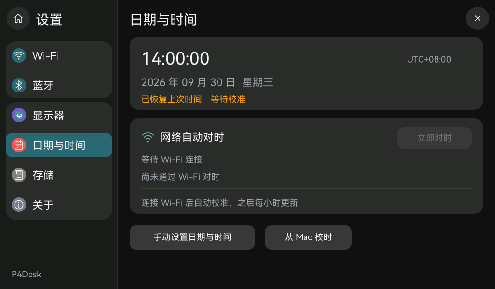
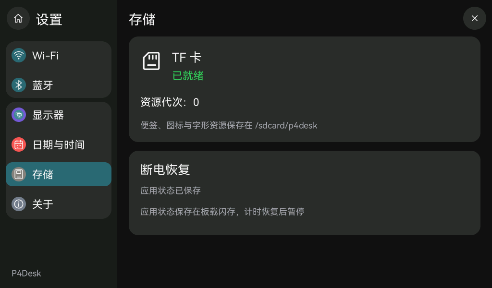

# 无 RTC 备用电池时的断电恢复

## 恢复范围

| 内容 | 下一次上电的行为 |
| --- | --- |
| 时间 | 从上次保存的 UTC 时间继续计时，桌面显示“时间待校准”，设置页显示“已恢复上次时间，等待校准”。Wi-Fi、Mac 或手动校时成功后显示准确时间。没有记录时等待校时。 |
| 最近应用 | 保留最近四个不同应用的顺序，包括已经关闭的应用入口。 |
| 活动应用 | 恢复之前的本地前台页面及最多四个后台实例，已关闭／淘汰的实例不复活。 |
| 计算器 | 保存输入、未完成的表达式、模式、角度、记忆值、重复等号状态及程序员模式完整 64 位数值。 |
| 番茄钟／倒计时 | 恢复模式、阶段、剩余时间、倒计时预设及已完成轮数，**一律暂停**。不推算断电时长，不重复播放结束动画。 |
| 便签 | 正文和删除记录继续使用现有存储；浏览状态按稳定 ID 恢复选择和滚动位置。已删除／不可用的选项回到第一条。 |
| 设置 | 保留设置分区；亮度、时区及无线配置继续使用既有存储。输入中的 Wi-Fi 密码、删除确认框不恢复。 |
| USB 副屏 | 重启回到 Pad，保留最近入口；不自动恢复虚拟屏、USB 会话或发送动作。 |

**闪存不能代替持续走时的 RTC。** 完全断电后，软件无法知道断电经过多久。保存的时间只用于离线启动的近似显示，不向 Mac 报告为已校准时间。ESP-IDF 的系统时间保持能力还取决于复位类型；本实现保守地将读取的历史记录标为待校准。[ESP-IDF 6.0.2 系统时间说明](https://docs.espressif.com/projects/esp-idf/en/v6.0.2/esp32p4/api-reference/system/system_time.html)

升级前仅存在内存中、已经丢失的历史无法补回；本功能从新版开始建立记录。

## 保存时机

- 每 500 ms 采样可恢复状态；连续操作合并，停止操作约 1 秒后提交，持续操作最多约 5 秒提交一轮。
- 运行中的计时器每 10 秒记录一次剩余时间；开始、暂停、重置、完成、切换阶段也触发状态保存。
- 已有有效时间时，每 60 秒记录一次时间。首次成功校时及估算转为准确时间会触发保存。
- 启动展开／收缩及番茄钟完成动画期间推迟开始新的写入。实际保存完成还取决于闪存 IO，不能把上述周期当作硬实时保证。
- 突然断电可能丢失尚未写入的最后一小段操作。已暂停计时不会随下次开机等待网络对时而减少。
- 「设置 → 存储 → 断电恢复」显示保存结果。写入失败时提示并隔 5 秒重试。

## 实现

数据保存在板载 `p4settings` SPIFFS 分区的 `/flash/session.0.json` 和 `/flash/session.1.json`，无需 TF 卡即可保存应用会话。TF 卡挂载、便签代次与删除记录遵循原有机制；没有增加格式化路径。

记录采用版本号、递增修订、SHA-256 校验和两个交替槽位。写入另一个槽位的临时文件、flush、fsync、关闭并改名后才报告成功；原有效槽位保留。启动按修订从可校验、可解析且字段合法的记录中选择最新一份。不完整临时文件不参与恢复，两个槽均无效时回到默认状态并提示。

会话载荷限制 64 KiB，应用数量、输入大小、计算器进制、浮点数、计时范围和时钟范围均有验证。计算器保持原表达式状态，避免把结果截图或格式化文字当成可继续计算的数据。

保存线程使用单条有界队列和单个在途快照，优先级 1、8 KiB 内部 RAM 栈。UI 只复制有界状态，序列化和闪存读写在后台执行，不持有 UI 锁。JSON 读写使用缓冲，避免逐字符访问 SPIFFS。日志只记录成功与否、应用数量、耗时和栈余量，不记录应用输入、便签正文或凭据。

## 验证

主机自动测试覆盖计时暂停恢复、计算器继续运算、完整 64 位数值、最近入口与实例生命周期、便签稳定 ID、USB 不自动重连、槽位损坏／写入中断／语义无效记录回退、写入失败重试、保存节流与估算时间转准确时间。

构建、刷机、设备复位日志和用户冷启动验收分别记录在 [断电恢复验收](acceptance-session-recovery.json)。完全断电、触摸与运行流畅度需实机确认，不能仅凭主机测试或成功构建认定。
