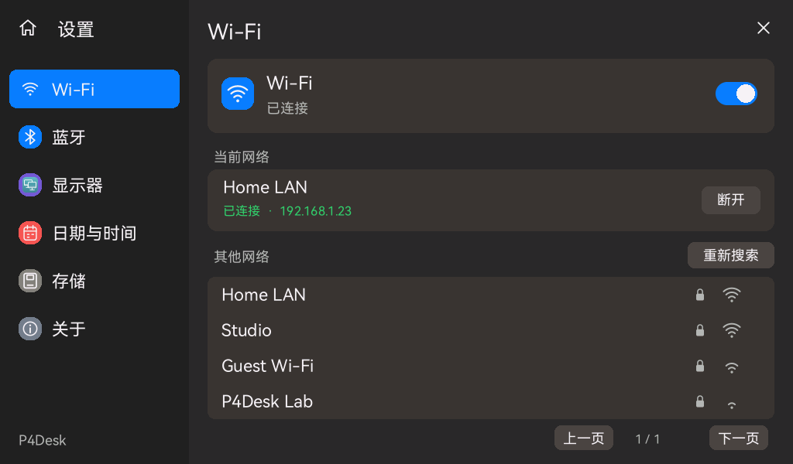
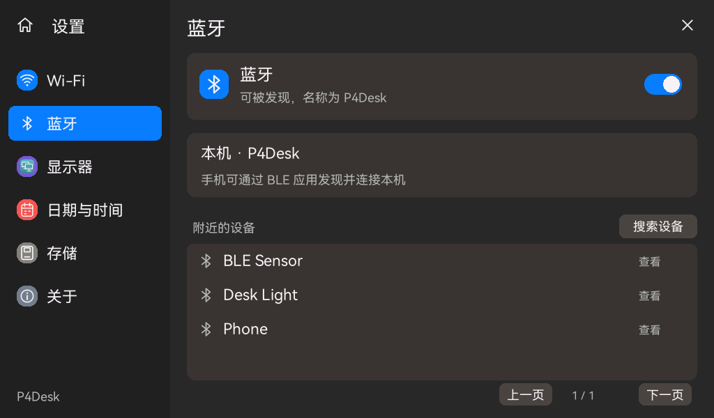

# Pad 设置与无线连接

## 界面

适配 1024 × 600 横屏，左侧为 Wi-Fi、蓝牙、显示器、日期与时间、存储和关于。
深色分栏、圆角卡片、蓝色选中项和开关参考 macOS 设置；Home 在左上角，关闭在右上角。
保持 Rust tiny-flutter / tiny_gfx 绘制、已有图标启动动画和应用状态。
所有图标仍为自制 SVG 生成的矢量几何。

## 预览

下图由实际 Rust 界面使用合成数据绘制，不是实机网络截图。





## 桌面 Wi-Fi 状态

右上角从左到右为 Wi-Fi、USB、TF、电池。Wi-Fi 只显示矢量图标，不显示“已连接”等文字。

- 未连接、连接中、模块不可用时为灰色；关闭 Wi-Fi 后为灰色斜线图标。
- 已连接时圆点为绿色，根据信号强度将对应弧线设为绿色；其余弧线保留灰色。
  RSSI ≥ -55 dBm 时三层弧线全绿，
  -67～-56 dBm 时两层绿，-80～-68 dBm 时一层绿；更弱时只有底部圆点绿色，三层弧线均为灰色。
- 连接成功后立即开始采样，以后每 5 秒通过 C6 的 `esp_wifi_sta_get_ap_info` 更新；
  读取失败不沿用旧强度，而显示绿色圆点与灰色弧线，详情提示“读取中”。此采样在无线任务执行。
- 点按展开信息卡，显示网络名称、IP、具体状态、RSSI；“Wi-Fi 设置”直接进入设置页。
- 长网络名称按实际文字宽度省略；断开后不显示旧 IP。没有添加互联网可达性检测。

桌面沿用 250 ms 的快照轮询，在连接状态或信号档位变化时刷新；
详情卡展开时刷新 RSSI 数值。BLE 广播和同一信号档位内的波动不会单独触发桌面重绘。
C/Rust 内部快照追加 RSSI 和有效标志，双方检查 2456 字节与字段偏移；USB 协议不变。

## Wi-Fi

- 使用板载 ESP32-C6，通过 SDIO 与 ESP32-P4 通信；支持 **2.4 GHz** 网络。
- 首次安装无线功能默认开启，之后记住开关状态。
- 支持扫描、信号强度、加密状态、触摸键盘输入密码、连接、IPv4 地址、断开、忘记网络。
- 支持开放网络、WPA2 / WPA3 Personal；密码为 8–63 个可打印 ASCII 字符。
  暂不支持企业认证、WEP、隐藏 SSID 输入、网页门户登录和 64 位十六进制 PSK。
- 成功获取 IP 后才保存最后一个网络；错误密码不会覆盖此前成功的配置。
  开机或打开 Wi-Fi 后自动尝试这个网络；意外断开会有限重试。
- 密码保存在设备 NVS，不保存到 TF，不经 USB 发给 Mac，不打印在日志中。
  本版本没有启用 Flash 加密，不将 NVS 保存描述为加密存储。
- 网络列表上限 16 项，按每页 4 项显示；重新扫描后的旧项会提示重新选择。

## 蓝牙（BLE）

面向手机和其他 BLE 设备，使用 NimBLE Central + Peripheral：

- 开关与自动保存状态；首次启动控制器后自动扫描一次，也可以手动搜索。
- 每轮扫描 10 秒，上限 16 台设备；显示名称、信号和是否可连接。
- 可连接一个外围设备并发现 GATT 主服务；可发起 Just Works 配对、加密，保存 bond，断开和忘记当前配对。
- 同时广播 **P4Desk**，允许一个手机等 Central 连接。
  暴露 Device Information 服务（0x180A）及厂商、型号、版本三个只读特征。
- 手机需用 BLE 调试／客户端应用发现并连接。通用 BLE 外设不一定出现在手机系统蓝牙列表。
- 蓝牙页显示实际连接和加密状态；BLE 服务列表不是通用设备控制器。
  尚未实现任意特征读写／订阅、指定传感器协议、手机通知同步、文件传输、传统蓝牙音频、HID。
  需要输入 PIN 或数值确认的配对尚未实现。

## 底层与构建

- ESP-IDF 固定 6.0.2，`esp_wifi_remote` 1.2.5，`esp_hosted` 1.4.7；组件 hash 记录在 lock 中。
- C6 SDIO slot 1：CLK 18、CMD 19、D0 14、D1 15、D2 16、D3 17，复位 GPIO 54。
- TF slot 0。兼容层复用 SDMMC 控制器，C6 初始化失败仅清理自己的槽位。
  先完成 TF 挂载，再由无线任务初始化 Hosted；不改变 TF 自动格式化策略。
- 无线 RPC、扫描和 NVS 写入由独立工作任务执行，UI 每 250 ms 读取版本快照，显示任务不等待网络。
- C / Rust 固定宽度结构由双方检查大小与偏移；此接口不增加 USB 协议消息。
- 首次使用工厂 C6 固件。若控制器或 SDIO 不兼容，页面会报告不可用／初始化失败，
  不把 Wi-Fi 硬件存在视为 BLE 已可用。不自动更新或覆盖 C6 固件。
- UART 和原生 USB Serial/JTAG 输出诊断，日志仅记录错误类别、扫描数量，不记录网络名称、密码、设备标识或广播载荷。

## 本地验证

```sh
cargo test -p app-launcher -p rust_main
python3 scripts/generate-vector-icons.py --check
cargo run -p app-launcher --features screenshots --example settings-preview
./scripts/build-firmware.sh
```

`artifacts/settings` 下的截图使用合成数据验证布局，不能作为真实连接证据。
实机验收与固件 SHA256 见 `docs/acceptance-settings-wireless.json`。
