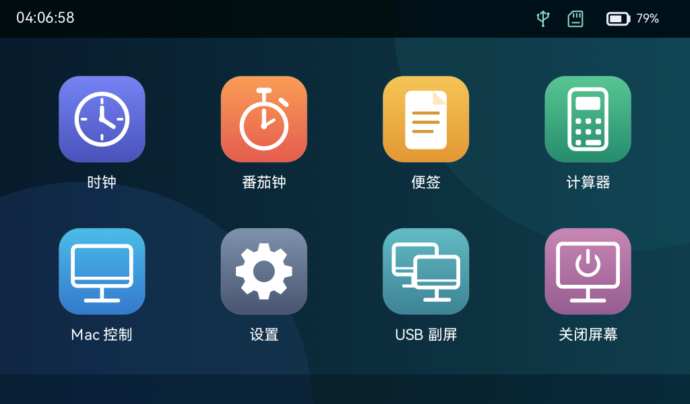
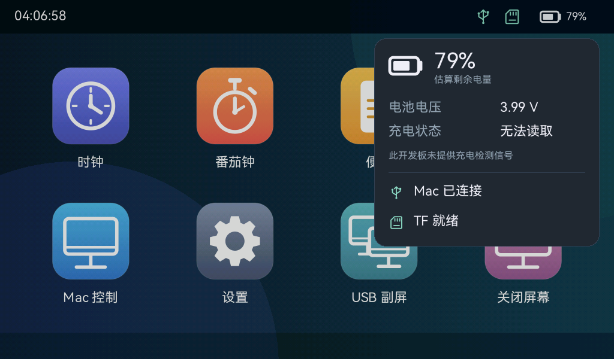
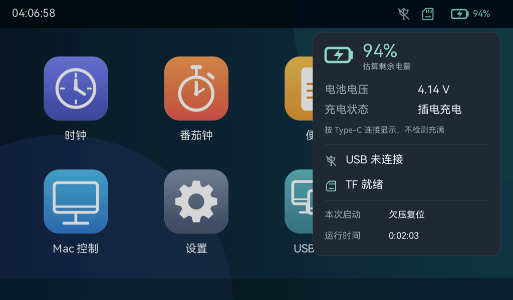

# 桌面状态与电池

Pad 桌面右上角依次显示 USB、TF 和电池，使用项目的 SVG 矢量绘制路径。

| 状态 | 图标表现 |
| --- | --- |
| USB 与 Mac 应用握手完成 | 绿色 USB |
| USB 已枚举、Mac 应用未就绪 | 橙色 USB |
| USB 未连接 | 灰色 USB 加斜杠 |
| TF 已挂载／未挂载 | 绿色 TF／灰色 TF 加斜杠 |
| 电池电压可读取 | 电池图标和估算百分比；≤20% 橙色、≤10% 红色 |
| 电池电压读取失败或无有效采样 | 灰色空电池和 `--%` |
| 原生 Type-C 检测到电脑 SOF | 按用户约定保持绿色闪电和“插电充电”，100% 也不改成“充满” |

点击任意状态图标打开同一张详情卡，查看估算剩余电量、电压、充电状态、USB 与 TF 状态。点击卡片内部保持打开，点击外部只关闭卡片，本次点击不穿透至桌面应用。进入应用、关闭屏幕或切换副屏时关闭详情卡。

## 数据来源与限制

用户已确认电池直接连接开发板电池接口。7B 的 BAT 电压经 R92 200 kΩ／R93 100 kΩ 分压到 GPIO20（ADC1 channel 4），采用 ESP-IDF 曲线校准，每两秒后台采样。每轮采样 16 次，剔除两端各两个样本后取平均值，再乘以 3 还原电池电压；UI 使用平滑和百分比迟滞抑制跳变。采样不会阻塞 UI 绘制任务。

电量按单节、满充 4.2 V 锂电池的通用电压曲线估算。当前电池型号、容量和实际放电曲线未提供，充电和负载也会影响端电压，因此该百分比不是精确电量计，不显示剩余使用时长。读取失败或电压不在有效范围时清除旧值，不伪造 0%。电池是否物理插入不能仅靠这一电压可靠判断，本版本以用户已安装电池为前提。

**现有硬件不能读取准确的充电／充满状态。** ETA6098 的 STAT（原理图网络名 `change`）只连接充电指示灯，未连接 MCU。按用户“插入 Type-C 就保持充电”的显示约定，HAL 使用 `usb_serial_jtag_is_connected()` 检测原生 USB1.1／FS Type-C 的电脑连接，映射为独立的 `PluggedInAssumed` 状态，显示闪电及“插电充电”。它不是 STAT 或充电电流检测；即使电量估算为 100% 也保持插电图标，不宣称已经充满。

该 API 依据主机 SOF，**无法识别充电器、充电宝、仅供电线，或另一个 CH343 UART Type-C**。电脑挂起停止 SOF 时也可能返回未知。没有 SOF 时恢复普通电池图标，详情显示“无法读取／未检测到 Type-C 电脑连接”，不宣称一定在电池供电。副屏 Type-A 的 USB 枚举独立于此逻辑。准确覆盖所有供电入口仍需要硬件检测信号；本次未修改充电参数、保护逻辑或引脚接线。

## 插拔电源重启诊断

用户最新澄清：**插入充电器不重启、拔出充电器重启，插入／拔出 Mac 都重启**。这取代早期“插拔充电器也都会重启”的概括；具体 Type-C 口未逐一对应每次操作。电池详情实际读数为 **4.14 V、约 94%**，容量未知。此读数证明电压读取已可用，不能证明切换瞬间电源轨稳定或估算准确。

详情卡新增“本次启动”与“运行时间”：前者读取 ESP-IDF 6.0.2 `esp_reset_reason()`，后者使用启动以来的单调时间，切换应用不清零。刷机复位产生的原因不能作为故障证据，需要刷入后复现一次插拔再读取。

| 本次启动 | 可支持的判断 |
| --- | --- |
| 欠压复位／电源毛刺复位 | 芯片检测到了欠压或电源异常，需要排查供电切换、电池、线材和保护板 |
| 上电／硬件复位 | 可由电源中断或 EN 硬件复位触发，单靠这个值无法区分 |
| USB 复位 | USB 外设触发复位，进一步查主机操作与 USB 状态 |
| 程序异常／看门狗复位 | 需要异常日志定位软件路径 |

官方原理图中 Type-C 外部电源经 Q4 控制电池升压芯片 EN，电源切换由硬件完成。结合拔出充电器重启的反馈，电池接管瞬态是排查方向；Mac 插入的复位原因需另外确认，不能将所有场景合并诊断。当前固件保留欠压保护，不调整阈值、不驱动未确认的引脚、不烧写 eFuse。

后续用户反馈启动原因为 **“上电 / 硬件复位”**，对应 `ESP_RST_POWERON`；没有说明这次读数对应插入、拔出或两者。该结果不是软件异常／看门狗／USB 复位记录，也不能单独证明欠压或排除 EN 复位。下一步先断开 Type-A 副屏及其他 USB 线，仅以电池和一个 Type-C 充电器测试，再将亮度降至设置内的 25% 对比，分别排查其他供电线路影响和负载影响；对比结果待用户反馈。

若隔离后仍重启，需要在实板同时观察 Core_5V／ESP_3V3 与 ESP_EN 的切换波形，区分供电轨跌落和复位引脚脉冲。每两秒读取的 BAT 电压不能捕获该瞬态。升压芯片 SCT12A0 有 EN 启停与软启动过程，可作为电路排查依据，不能据数据手册推定这块实板的实际中断时长或直接给出替换电容值。

隔离对比的用户反馈为 **“两种情况下都重启”**：仅接电池与一个 Type-C 充电器、原亮度及 25% 亮度均未消除重启。随后澄清充电器插入不重启，因此此处不能解释为插入与拔出均重启。充电器没有闪电图标是 SOF 检测的能力边界，不证明未充电。详见 [电源切换诊断与微雪反馈草稿](power-handover-diagnosis.md)。

最后用户确认：**保持一个 Type-C 的普通 5 V 充电器持续供电，再从另一个 Type-C 插拔 Mac，不再重启**（本次 Type-A 断开）。这有力支持电源接管瞬态的排查方向，也验证了一种当前可用的稳定供电接法；尚未证明电池无缝切换可用，具体元件和波形仍待硬件确认。

依据：[微雪 7B 官方原理图](https://files.waveshare.com/wiki/ESP32-P4-WIFI6-Touch-LCD-7B/ESP32-P4-WIFI6-Touch-LCD-7B.pdf)、[官方开发板说明](https://docs.waveshare.com/ESP32-P4-WIFI6-Touch-LCD-7B)。

## 渲染预览与验收

下图由实际 Rust UI 渲染器输出，使用合成的 **79%、3.99 V** 数据检查排版，**不是开发板实测电量**。

构建、刷机与实机验收分别记录于 [本次验收数据](acceptance-status-battery.json)。硬件电压读数、实际点击与图标效果需由开发板确认。

插电显示与复位诊断的后续记录见 [诊断版验收数据](acceptance-typec-reset.json)。

上图的 4.14 V／94% 和“欠压复位”是为预览构造的数据；其中欠压复位没有得到实机确认，不能据此诊断重启原因。
