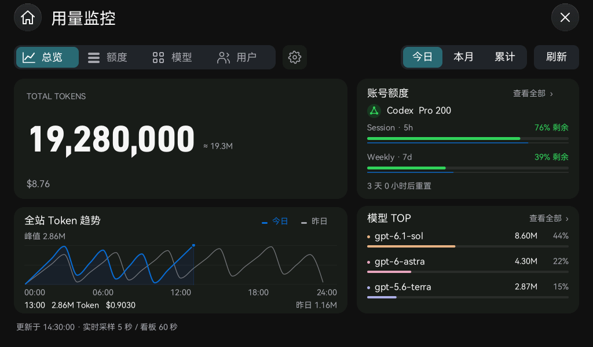
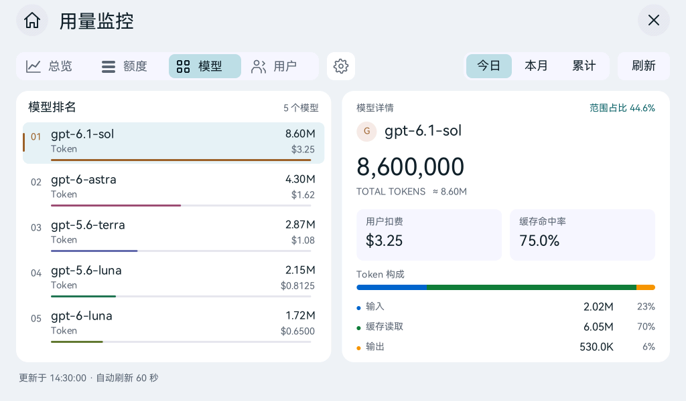
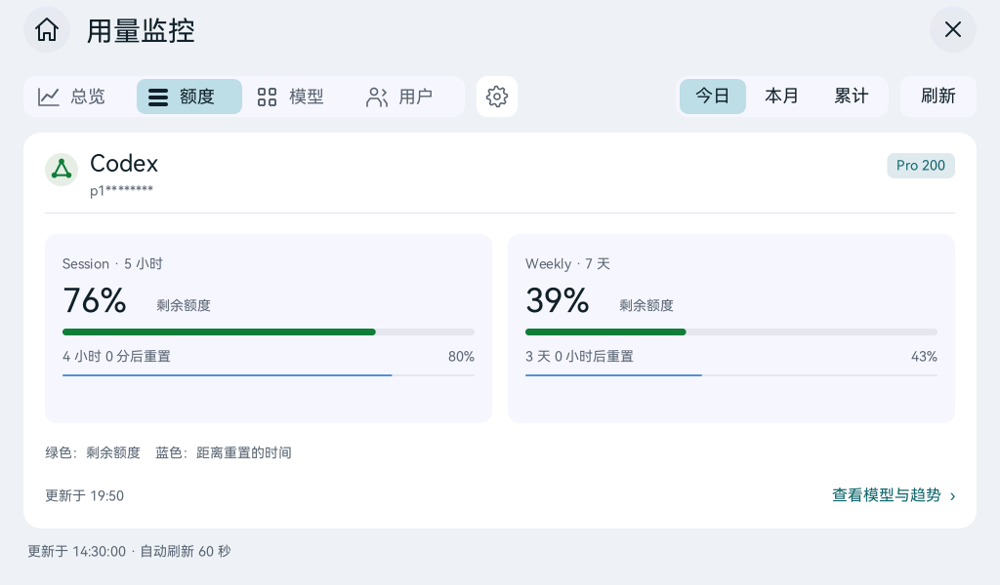
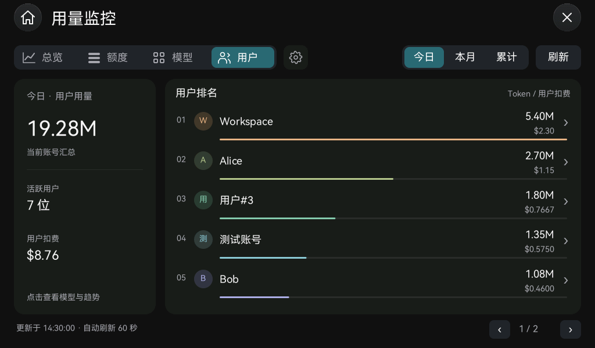

# Pad 用量监控

## 运行与配置

桌面第二页的“用量监控”已接入 Sub2API 管理接口。P4 通过板载 Wi-Fi 和 HTTPS 自行请求数据；Mac 用于首次下发配置，之后无需保持连接。

1. 在设备设置中连接 Wi-Fi，并完成日期与时间同步。TLS 证书校验要求有效时间，断电恢复的估算时间不能用于新连接。
2. 打开 Mac P4 Desk 的“用量监控”标签页，填写 HTTPS 站点和管理员 API Key，或点“读取本机用量监控配置”。读取使用只读 SQLite 连接，不修改原应用数据。
3. 点“下发并验证”。设备验证管理统计和账号列表后，才将配置写入内部存储，并打开监控页面。
4. 也可在板上“连接设置”使用触摸键盘输入。相同站点编辑时密钥留空保留原密钥，变更站点必须重新输入。
5. “断开并清除密钥”写入删除记录并清除旧配置槽，不影响 Wi-Fi 设置或便签。

密钥保存在内部 Flash 的监控配置记录中，当前未单独加密。Mac P4 Desk 只在内存中暂存输入，成功下发后清空输入框。密钥、完整邮箱、账号上游凭据和原始响应均不进入运行日志或统计缓存。

## 页面和统计口径

| 页面 | 内容 |
| --- | --- |
| 总览 | 桌面端形式的 TOTAL TOKENS、完整等宽数字与近似值、下方费用；今日／昨日 Token 趋势、账号额度和模型 Top 排名 |
| 账号额度 | 计划和脱敏账号，5h／7d 剩余额度与重置时间双进度；单账号横屏并排，可打开模型用量详情 |
| 模型 | 左侧模型排名，点选后右侧显示完整 Token、扣费、缓存命中率和输入／缓存／输出构成 |
| 用户 | 当前范围用户汇总和彩色排名，优先显示用户名称、无名称时显示“用户#ID”；点击查看该用户的模型构成和用量趋势 |
| 连接设置 | 站点、管理员密钥、验证保存和清除连接 |

- 以本地 Sub2APIMonitor 当前源码为接口依据：统计使用 `actual_cost`；今日账号批量接口使用 `user_cost`。
- 今日总览优先调用 `accounts/today-stats/batch`，汇总当前完整账号集合。若批量接口失败，保留服务器全站统计并显示部分未更新状态；快照仍保存实际来源。按用户要求，主数卡不再展示范围／来源说明文字。
- 本月为当前自然月，累计总量来自服务器历史累计；累计图表只绘制近 90 天，并明确标注，不把近 90 天当成累计总量。
- 昨日对照为昨日全站接口的完整 24 小时数据。今日总览的全站 Token 趋势横轴固定为 `00:00`～`24:00`，标注每 6 小时刻度；按真实小时位置绘制，`12:00` 始终位于中线，新增采样不会拉伸旧点。今日蓝线与填充仅画到采样已到达的小时，未来不补零、不延长曲线；昨日灰线独立显示完整一天，共用 Token 比例。`24:00` 是横轴边界，最后实际小时桶是 `23:00`，不添加虚拟数据点。未来空白区点按不产生读数，昨日提示仍匹配当前选择的同一小时。主数卡不再另列昨日总量。今日主数是账号批量汇总，图表标题仍明确为全站趋势。仅成功解析的接口响应补齐已到达的缺失时间桶为零；失败时保留缺失与错误，未返回请求数仍显示横线。本月、累计及账号／用户详情保留原日期／样本范围。
- 账号／用户详情通过 `account_id`／`user_id` 过滤模型和趋势。账号详情主数来自账号模型汇总，标题显示账号 ID 和所选周期，不能视为完整结算账单。详情模型构成可翻页选择，切换无需新请求。账号费用采用用户扣费，不使用上游成本。
- 用户页保留明确的今日／本月／累计范围切换，与 Mac 当前固定今日的用户页有所不同。左侧汇总只覆盖实际返回用户；达到接口 200 项上限时标“前 200 位用户汇总”，不冒充全站。
- 用户名称按用户资料的 `notes`（备注名称）、`username` 顺序选择，清除边缘空白和控制字符，最多保留 80 个 Unicode 字符；不使用邮箱作名称。缺少名称才显示“用户#真实 ID”，排名变化不会改变编号。列表、头像与详情标题使用同一名称；列表名称按列宽省略，数值单独对齐。
- 用量接口未带名称时，补查 `/admin/users` 并按真实 ID 合并。单 Worker 的名称缓存最多 200 项，名称及无名结果均缓存 5 分钟，按站点与密钥摘要隔离；每批资料每页 25 项、最多 8 页，已找到当前排名用户即停止。资料请求失败或超过扫描边界时，保留有效用量与已取得名称，并标注部分名称未更新；后台不弹出重复消息。TF 快照保存所展示的名称，旧快照缺少 `name` 时兼容恢复为编号；日志仅记录名称数量。
- 主页模型 Top 的百分比为该模型／当前范围全部模型 Token；模型和用户排名条长度以排名第一为分母。缓存命中率为 `cache_read / (input + cache_read)`，无输入时显示横线。
- OpenAI 额度只读取 `codex_5h_*` 和 `codex_7d_*`，不猜测 primary／secondary 对应关系。Anthropic 仅 OAuth／SetupToken 请求 passive 用量。
- 绿色进度表示剩余额度，细蓝条表示距离重置的剩余窗口时间，优先使用服务端 `window_minutes`。倒计时到期显示“等待额度更新”，不自行恢复 100%。缺失有效窗口显示横线。
- 日期范围使用设备时区（默认 Asia/Shanghai）；其他整点时区使用 IANA Etc/GMT 名称。非整点时区明确报错，不静默套用服务器时区。服务器今日汇总仍遵循服务器的今日定义。

## 调度、恢复与容量

- 保留 tiny-flutter／tiny_gfx Rust UI，ESP-IDF 6.0.2 C HAL 负责 HTTPS；独立工作线程请求、解析和保存，UI 不持锁等待网络。监控线程使用 16 KiB 栈，TLS 堆缓冲分配到 PSRAM，并将任务栈／DMA 专用的内部预留池从 64 KiB 增至 128 KiB，避免 UI／JSON 普通分配挤占 C6 SDIO 收包缓冲。
- 完整看板每 60 秒刷新；无详情的今日总览另按采样开始时刻每 5 秒更新主数和今日趋势，其他周期／页面／详情保持 60 秒。请求忙时跳过过期采样槽位，保留最新时刻，不排队追赶；失败退避至 30／60／120／240 秒，也可手动刷新。Wi-Fi 连接和可信校时恢复后立即重试，无需等待先前离线退避；HTTP／认证错误继续保留原退避。只有前台或保留在后台的监控实例自动轮询。
- 前台监控静置时，单纯时间推进只在分钟边界更新界面，后台时钟与计时持续更新；网络结果、连接状态、点击、校时与倒计时结束仍立即刷新，减少无效整屏绘制。
- 最多四份 RAM 页面快照，按站点／密钥摘要、日期、时区、页面、周期、详情对象完整隔离。回到已看页面先展示快照并标记，再异步更新；更换或清除配置时清空，旧请求不能写入新页缓存。
- 最多一个正在执行的请求批次和一个最新待执行批次。切换页面／周期使用代数淘汰旧结果，不允许旧账号或周期的迟到数据覆盖新页面。
- HTTP 只接受 HTTPS，验证 CA 和主机名，不自动跟随重定向。单响应最多 256 KiB，单请求有超时；错误文本不包含 URL、密钥或响应正文。
- 账号最多 200 个，逐页校验总数和去重，拒绝把不完整账号集合用于汇总。模型和用户最多 200 项；列表采用轻量分页，避免生成数十 MiB 的滚动位图。
- TF 保存最近一份脱敏聚合快照，按站点、凭据摘要、周期、日期、时区和对象隔离。网络失败只恢复相同范围的快照，标为“上次数据”。TF 不可用时在线查看和内部配置仍可工作。
- 关闭／重新打开应用遵循最近应用和最多四个后台实例的规则；旧的占位入口会话可恢复为实际监控应用。

设备版保存有限聚合数据，不复制 Mac 的 SQLite 请求历史库。Mac 中的长期周窗口归档、服务事件翻译与完整历史明细查询不在本版设备页面中。

## 验证入口

- `cargo test -p app-launcher --test usage_monitor --test usage_ui --test usage_cadence`
- `cargo test -p app-launcher --test usage_user_names`：名称优先级、无名回退、分页边界、缓存过期与配置隔离。
- `cargo test -p rust_main usage::tests --lib`
- `swift test --package-path desktop/macos`
- `cargo run -p app-launcher --features screenshots --example usage-preview -- artifacts/usage`
- `P4Desk.app/Contents/MacOS/P4Desk --configure-monitor-from-mac`：读取本机已保存配置并下发，输出仅包含连接／保存结果；使用前退出正在运行的 P4 Desk，避免占用同一 USB 接口。

构建、刷机、HTTPS 实机访问与人工界面验收分别记录在 `acceptance-usage-monitor.json`。

2026-10-08 的用户名称调整，测试、固件和人工确认分别记录在 [用户名称验收](acceptance-usage-user-names.json)。

2026-10-07 的全天横轴修正，坐标／未来留空／缓存及触摸回归、构建、刷机和实屏确认分别记录在 [全天趋势验收](acceptance-usage-trend-day-axis.json)。

## 启动与控制台兼容

ESP-IDF 6.0.2 的 Picolibc 标准输出实际使用 VFS 文件描述符，当前板上 C `stdout` 为 fd 3，而 fd 1 是可选的 USB Serial/JTAG 输出。Rust `println!` 固定写 fd 1，在该接口未就绪时可能返回失败并触发 panic。设备端的会话、性能和监控诊断统一经由 ESP-IDF 日志输出，使用 512 字节有界缓冲，诊断输出失败不影响 UI 运行。

首次 HTTPS 实机测试另发现 SDIO 接收缓冲分配断言；通过 TLS 外部 PSRAM 分配和缩减监控线程内部栈处理，验证记录同时保留失败尝试与修复后结果。

## 横屏看板与显示诊断（2026-10-06）

布局参考已安装的 macOS 用量监控及 `Sub2APIMonitor/Panel.swift`，保留 Folio 深浅色外观。顶部采用紧凑图标导航和范围切换；正文分为主指标／趋势和额度／排名两栏。图表线条使用保留极值的平滑插值，点按选择时间桶；拖动不会误选。长名称按实际字体测量截断，避免侵入数值列。

以下为生产 Rust UI 的合成数据预览，不包含真实账号或统计：

针对用户报告的“短暂闪绿后仍在原页面”，保留既有帧所有权、旋转和面板时序，加入有界显示欠载诊断。中断只记录饱和计数和首次／最近单调时间，不打印或复位。`board_p4` 每 30 秒输出 `display underruns`，空闲没有新 UI 帧时也采样；可与 HTTPS／UI 绘制／会话保存日志对照。计数为零只表示观察窗口未检测到该类硬件欠载，不能单独证明所有闪屏原因都已消除。

构建、刷机、人工视觉反馈与短期稳定性观察另记于 `acceptance-usage-monitor-redesign.json`；首轮基础移植证据仍保留在原记录中。

## 主数动画与实时采样（2026-10-06）

主数采用桌面端的 `TOTAL TOKENS`、完整数字、右侧一位小数近似值和下方费用结构。数字使用已有许可的 DINish Heavy，数字槽等宽、逗号保持自然宽度；过渡期间保留最宽布局，结束时取消旧宽度。首次结果直接显示，同一范围变化采用 1 秒四次缓出，可从当前展示值中断；已有缓存的周期切换使用 800 毫秒。无数据、跨日期／详情／站点以及应用隐藏时不跨范围计数。展示插值不会写回真实统计。

数字动画通过自定义 RenderBox 的局部 damage 推进，约 33 毫秒门控，不提高 Launcher 全局 revision；只绘制不透明数字区域，折线在该区域外直接跳过绘制。主数和完整快照更新仍触发一次正常页面更新。生产 UI 测试验证中间帧限定在数字条、下方像素不变，最终与完整静态重绘逐像素一致。

折线采用 Steffen 保形三次曲线和抗锯齿圆角连接，穿过原始时间桶、不改变真实采样和峰值；无效或倒序坐标断开曲线。按钮选中态与按下态统一为较小圆角，导航／范围组保持一致留白。

快速采样顺序读取在线统计、当前已知账号的今日批量统计和今日趋势；额度、模型和昨日数据来自 60 秒完整看板。快速结果只更新 RAM，避免每 5 秒写 TF。P4 仍使用一个 HTTPS Worker，显式刷新优先、旧范围结果淘汰、认证退避不变。日志中的 `interval_ms` 是实际 worker 起始间隔，`duration_ms` 是整批请求耗时；忙时的跳槽可能使某次真实间隔超过 5 秒。

本轮构建、刷机、实际采样间隔与人工反馈记录在 `acceptance-usage-monitor-headline.json`。

## 主数留白与动画细化（2026-10-06）

按截图精简 TOTAL TOKENS 卡片：移除周期／来源说明、请求数、昨日总量及中间分割线，只保留标签、完整数字、右侧约数与费用。卡片从 188 增至 208 像素，数字区从 58 增至 90 像素，最大数字字号从 52 增至 64；常见九位数可容纳完整值，较长总量按实际字宽缩小。左右两栏顶部卡片高度一致。主数字按实际字形包围盒在卡片垂直中心对齐，较长值缩小字号时仍保持中心；标签和费用靠近上下边缘并统一留白。

与桌面客户端相同，约数按真实目标值显示，计数动画期间不随展示插值改变。数字字形在布局时缓存，绘制时直接使用抗锯齿掩模；同位数的小幅变化只更新变化的数字后缀，位数／字号／约数布局改变时清除整个数字条。裁剪边界对齐整数像素，防止重复混合造成边缘残影。生产 UI 测试覆盖小幅更新、跨位数、最长 u64 回落，并验证最终像素与独立静态重绘一致。

HTTPS 连接只在同一 worker 批次内、相同 authority 和凭据下复用。完整读取 200 响应且服务端允许持久连接时才保留；失败、截断、容量不足、超时或源／凭据变化立即清理。每批完成、失败、取消和 worker 停止时释放连接及请求头凭据，不在两批之间持有 TLS 会话。日志仅记录复用标志、耗时、长度和内存统计，不包含 URL、密钥或响应正文。`scripts/test-monitor-http.sh` 同时验证响应读取和生产 C 传输的会话边界。

本轮构建、刷机、采集耗时和人工反馈另记于 `acceptance-usage-monitor-polish.json`。

用户在主数精简版仍报告短暂闪绿、之后停留原页。下一修正版启用 LCD/DW-GDMA 在 Flash 操作期间的中断保护和 32 KiB 分块 C2M，补充显示边界与提交健康诊断，并检查实际 ELF 中 ISR/队列依赖的位置。改动处理明确的配置风险；是否解决这次可见闪屏需要实机与人工观察，不能仅凭 bridge underrun 为零认定。初次未接受的排版与闪屏反馈保留在验收记录的 attempts 中。

用户随后接受主数高度与留白，短期未见闪绿，但又报告整屏横向绕回。故障影响应用顶部与左右两栏，继续保留已接受的排版。生产 Rust widget 的真实跨行输出与独立静态重绘逐像素一致；C 逐行拷贝、PPA 输入和完整 LCD 提交的坐标核查未发现整屏平移来源。

本轮增加 LCD 扫描读取仲裁优先级，修正 SDK bridge 欠载诊断阈值，并由唯一 display owner 采样 Host FIFO 错误。保护和诊断机制见 [构建说明](build.md#整屏横向错位的诊断与扫描保护)。此前正常 DMA 间隔与零 bridge 计数不能排除显示流失步；复位后恢复和短时正常也不能单独证明根因已消除。

## 页面细节精修（2026-10-08）

对照本地 macOS 客户端的账号身份、额度窗口和排名行，统一四个页面的视觉层次：

- 导航未选中状态降低强调，选中和按下保持相同圆角；深浅外观使用对应的控件底色。
- 额度卡片加入原创几何平台标记、计划标签及脱敏身份；单账号采用两个内嵌窗口区。绿色为剩余额度，蓝色为重置时间比例，低额度使用橙／红提示，缺失值明确显示“未提供”。单账号显示额度更新时间和查看模型／趋势入口。
- 模型、用户排名的 Token 与费用按实际字体宽度右对齐；名称受独立列宽约束。选中模型使用柔和底色及细色标，颜色由名称或用户 ID 决定，排名变化不会换色。
- 模型详情使用完整千分位主数，费用／缓存命中率分为两个指标区；输入、缓存读取、输出使用整体圆角构成条及数值／比例图例。构成比例用 `f64` 累加，三个 `u64` 大值不会溢出。
- 趋势图补充线段图例，底部读数按列宽截断并与昨日值分开对齐；加载和空数据状态补齐图标、标题和可操作说明。

已接受的 TOTAL TOKENS 208 px 高度、数字位置和费用位置保留；今日 00:00～24:00 横轴、未来留空、昨日全天参考和统计来源保留。未新增网络请求或持续装饰动画，5 秒主数／趋势采样与 60 秒看板更新继续使用原调度。新增总览蓝色时间条按分钟显示，与监控页的分钟重绘一致；服务端重置时间与精确计算函数不变。主数和费用继续使用不透明局部 damage，没有加入全卡渐变或实时模糊。

以下用户排名预览为生产 Rust UI 的合成数据：

本轮构建、刷写、像素一致性、时间条回归与短期设备诊断分别记录于 [页面细节验收](acceptance-usage-monitor-detail.json)。实屏美观、点击和长期稳定性由人工验收，预览与主机微秒数据不能替代。
