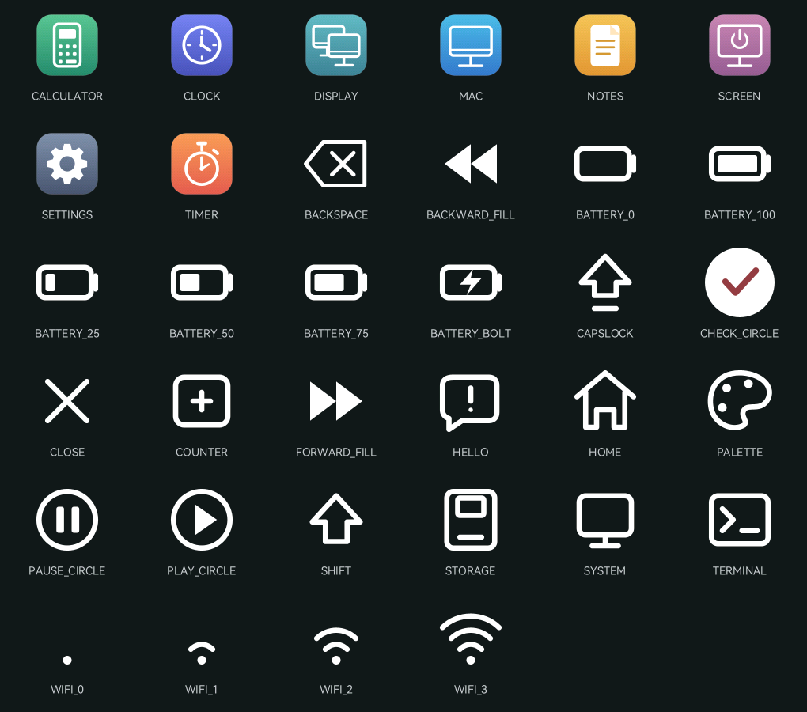
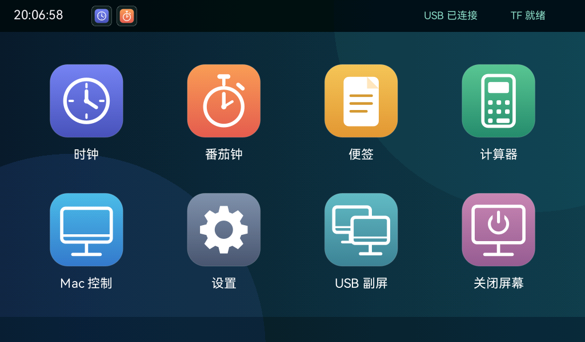

# SVG 矢量图标

## 范围

Pad 的八个桌面图标、状态栏后台应用小图标、Home／关闭、计算器退格、计时完成勾选，以及 tiny-flutter 的全部命名图标，统一采用可编辑 SVG 源和静态矢量几何。Mac 配套应用的连接、设置、增删、应用／媒体／键盘图标原本使用 SwiftUI SF Symbols，继续由 macOS 绘制矢量符号。

目录共有 **37 个原创 SVG**：八个桌面图标与 29 个通用图标，包括桌面 USB、TF 和离线斜杠。框架保留 `Icon`、`UiIcon` 与 `BakedIcon` 兼容名称，其中的图标数据已改为矢量引用。`Icon::size()` 控制实际绘制尺寸。数学运算字符和系统文字继续采用字体；字体字形不属于图标资源。





以上目录和桌面图为初版矢量图标预览；当前 USB／TF／电池状态栏及可点击详情卡见 [桌面状态与电池](status-battery.md)。

## 绘制路径

```text
原创 SVG → Python 检查与几何编译 → 静态 Rust VectorIcon
         → 按目标尺寸展开曲线 → tiny_gfx 覆盖率填充／描边
         → 原 RGB565 帧缓冲 → 原 display owner → LCD
```

SVG 编译器仅支持项目使用的明确子集：圆角矩形、圆、直线、多边形、M／L／Q／C／Z 路径、纯色、动态 tint 与两端点的纵向渐变。未知图元、未展开的变换、内联 style 和不支持的路径命令会报错。固件不解析 SVG XML，也不加载 PNG／RGB565 图标图集。

- **填充**：修复旧 `fill_path` 只绘制一像素轮廓的问题，实际填充路径内部，支持非零与奇偶填充规则。
- **描边**：八次纵向子像素采样配合横向解析覆盖率，绘制圆头、圆角连接与细斜线。合并同一描边的段、端点与连接后仅合成一次 alpha，避免半透明交点变深。
- **曲线**：按输出像素精度展开，不按固定低精度折线放大。桌面 146 px、状态栏 32 px、导航 32 px 和完成图标约 82 px 各自获得新的边缘覆盖率。
- **圆与圆角矩形**：直接计算填充和描边的扫描行区间，保留相同八次采样；圆环不再展开为大量短线段和连接片，减少触摸反馈重绘中的临时几何和计算。
- **渐变**：保持原桌面配色，渐变随几何的移动和缩放移动；RGB565 采用有序抖动减少色带。
- **裁剪**：局部重绘保留完整图形的采样坐标；完全空的裁剪区域保持为空，支持负起点。
- **内存**：使用有界扫描行和临时几何，未增加全屏超采样缓冲。旧八组 511,584 字节 RGB565／alpha 图标资源已移除。

屏幕本身为 1024×600／RGB565；矢量图标在该像素网格内计算平滑边缘，不改变屏幕分辨率。PNG／GIF 是同一 Rust 路径输出的预览文件。

## 计时完成图标

主题色圆形与白色圆角勾选来自 `assets/ui_icons/source/check-circle.svg`，与其他图标使用相同覆盖率抗锯齿。完成图标从底部弹到中央，圆形边界扩张铺满主题色，再从中心扩大透明圆形揭开页面；图标及扩散边界均无白色外框、内框或额外高光，保留有界折射。具体交互见 [Pad 番茄钟](pomodoro.md)。

## 桌面按压反馈与触摸

手指按下桌面图标时，图标缩到原尺寸的 **94%**，叠加少量白色提亮和约 **1.3 px** 的细轮廓；文字位置保持稳定。松手后才打开应用。移动超过 12 px、滑动、取消或失去原触点时，撤销按压效果，不触发应用；小范围手指抖动保持按压状态。

壁纸 `CustomPaint` 和无动画 `PageView` 向外提供实际按钮的重绘区域。按下只提交当前图标槽，拖动时同时覆盖原位置和当前命中位置，避免残留高亮。主机测试验证局部更新与一次完整绘制的像素完全相同，未命中区域保持原像素。

原硬件后端只轮询最新的按压状态，长重绘期间可能看不到一组短按／抬起。现在 GT911 采样任务以有界 **64 项 FIFO** 保存 Down／Move／Up／Cancel（共 776 字节队列）；保留手势边界和移出再返回的运动历史。Rust 每次 UI step 最多处理一项，使按下反馈先有一次呈现机会，切换应用后也先重建页面再处理下一项输入。该 step 后仍使用原 16 ms 主循环间隔；这里不是实测响应时间。

模式切换清空旧事件并等待手指全抬起再接受新手势。队列满时丢弃积压并仅送 Cancel，阻止不完整手势触发应用；生产者同样等全抬起再恢复。多点原始快照、USB 副屏触摸和现有方向校准沿用既有接口。

桌面松手打开应用后，SVG 图标保持原位和尺寸，主题色圆形从该图标中心铺满屏幕，再将主题色圆形从屏幕外侧向中心收起，露出应用；图标在收起之前渐隐。启动期间拦截点按和跨动画结束的抬起，避免误触页面操作；应用实例及后台计时保持既有生命周期。时序与原生预览见 [应用启动动画](app-launch.md)。

## 复现与验证

```sh
python3 scripts/generate-vector-icons.py
python3 scripts/generate-vector-icons.py --check
cargo test --workspace
./scripts/test-pad-touch.sh
cargo run -p app-launcher --features screenshots --example vector-icons-preview -- artifacts/vector-icons.png
cargo run -p app-launcher --features screenshots --example pad-icons-preview -- artifacts/pad-icons.png
cargo run -p app-launcher --features screenshots --example pad-icons-preview -- artifacts/pad-pressed.png pressed
./scripts/build-firmware.sh
```

Python 工具仅使用标准库及项目固定 Rust 工具链的 rustfmt。`assets/vector-icons.json` 记录源文件及生成几何的 SHA256；`--check` 逐字节复现且不修改文件。旧 `generate-desktop-assets.py` 是新编译器的兼容入口。

矢量测试覆盖所有 SVG 的多尺寸显示、桌面圆角、实际 `Icon::size`、动态 tint、局部与全帧像素一致、圆与斜线覆盖率、透明描边连接、复合路径填充、渐变变换、负起点与空裁剪；增加解析圆／圆角描边的空心、覆盖率对称、超宽描边和渐变裁剪检查。四项桌面交互测试检查实际局部提交、全部八个命中区域、拖动取消与轻微抖动释放。C 队列测试使用 ASan／UBSan 检查短点击、运动历史、回绕、溢出取消与模式重置。

用户已确认矢量边缘更细腻，同时指出桌面点击异常；原刷机记录保存在 [矢量图标验收记录](acceptance-vector-icons.json)，后续修正在 [桌面点击与液态玻璃动画记录](acceptance-pad-feedback.json)。构建、刷写和实机结果分开记录；主机测试不代替设备触摸响应或帧率测量。
