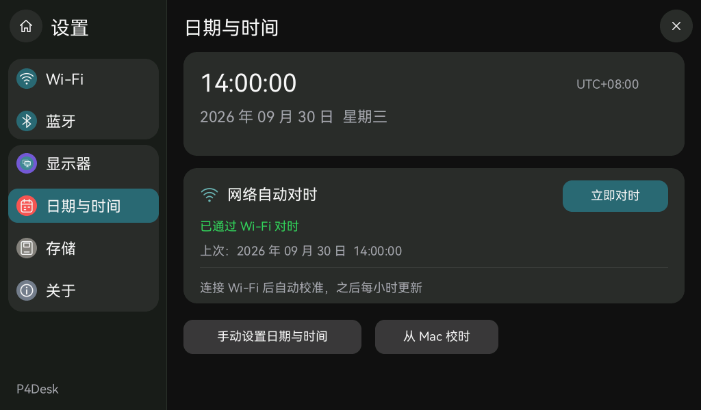

# Wi-Fi 自动对时

## 使用

1. 在“设置 → Wi-Fi”连接能访问互联网的 2.4 GHz 网络。
2. 获取 IP 后自动对时，无需运行 Mac 配套应用。
3. “设置 → 日期与时间”显示当前时间、UTC 偏移、网络对时状态和本次启动内上次成功的日期／时间。“立即对时”可主动刷新。

成功后每小时更新一次。单次最长等待 60 秒，失败后 5 分钟重试；断网后暂停网络请求，重新联网再自动对时。正在同步或 Wi-Fi 未连接时，立即对时按钮不可操作。Wi-Fi 已连接但互联网、DNS 或 UDP 123 不通时，显示超时，不会把“已连接 Wi-Fi”当作对时成功。

对时写入 UTC，沿用当前设备时区；默认 UTC+08:00，USB 校时及手动设置可以调整这个偏移。网络请求失败或断网不会清空已有效的时钟。冷启动优先恢复闪存中上次保存的时间，并显示“时间待校准”；没有有效记录时显示“待校时”。联网成功后清除估算标记。设置中的上次网络成功时间只描述本次启动的校时，不将历史保存记录当作新的网络校时。没有 RTC 备用供电时，无法由闪存得知完全断电的时长，详见 [断电恢复](power-loss-recovery.md)。

## 实现

- 使用 ESP-IDF **6.0.2** 的 `esp_netif_sntp_init/deinit`，通过其线程安全封装调度 lwIP。服务只在原无线工作任务中启停；没有新增任务、UI 网络等待或显示缓冲。
- 首选 `ntp.aliyun.com`，后备 `time.cloudflare.com`、`pool.ntp.org`。项目默认 `CONFIG_LWIP_SNTP_MAX_SERVERS=3`；由 lwIP 处理 DNS、NTP 报文及服务器切换。
- `p4desk_time_sync.c` 覆盖 IDF 文档允许的弱符号 `sntp_sync_time()`，在写入前检查尝试是否仍有效、时间范围和微秒值，再通过 `p4desk_time_set_checked()` 更新与 USB／手动设置共用的系统时钟及有效标记。仅接受 UTC 2000-01-01 至 2100-01-01，与现有毫秒级 HAL 边界一致。该服务自己维护结果，不使用 esp_netif 的等待信号量或完成事件。
- 当前结果与原无线快照一起由 Rust 每 250 ms 读取，设置页随状态更新；时钟及桌面随新的系统时间刷新。时间修正不改动时区设置，不写 Wi-Fi 凭据或 TF 内容。
- 网络重试、刷新周期和番茄钟／倒计时均以 `esp_timer` 单调时间计时，调整日历时间不会提前结束或延长倒计时。USB、手动、网络校时按实际成功写入顺序生效。
- 一个 NTP 尝试结束后释放客户端，成功结果保留；再次手动或定时触发会重新创建。重复点击不会延长正在进行的尝试，过期回包不会改写时钟。
- 日志只记录请求开始、成功 UTC 秒数或错误类别，不记录网络名称、IP、密码和设备标识。

参考：[ESP-IDF 6.0.2 系统时间与 SNTP](https://docs.espressif.com/projects/esp-idf/en/v6.0.2/esp32p4/api-reference/system/system_time.html)、[阿里云公开 NTP 配置](https://developer.aliyun.com/mirror/NTP)、[Cloudflare 时间服务](https://developers.cloudflare.com/time-services/ntp/usage/)。

## 页面预览



以上为同一 Rust UI 使用合成状态绘制的预览，不是开发板照片。

## C / Rust 内部接口

`RadioSnapshot` 从 2456 扩展为 **2472 字节**。偏移 2456 追加 `TimeSyncSnapshot`，四个 `u32` 字段依次是：

| 字段 | 含义 |
| --- | --- |
| `phase` | 0 等待 Wi-Fi，1 对时中，2 已成功，3 等待重试 |
| `error` | 0 无，1 超时，2 初始化失败，3 响应时间无效，4 系统时间设置失败 |
| `last_sync_unix_s` | 本次启动上次网络成功时间，UTC 秒；0 表示尚未成功 |
| `success_count` | 本次启动累计成功次数 |

无线命令 13 为 `WifiTimeSync`，没有附带数据。C 与 Rust 都断言结构尺寸和字段偏移。此为进程内 FFI，**USB 协议 v1 不变**，Mac 应用无需升级。

## 验证

```sh
./scripts/test-time-sync.sh
cargo test --workspace
cargo run -p app-launcher --features screenshots --example settings-preview -- .cache/folio/wifi-time
./scripts/build-firmware.sh
```

C 的 ASan／UBSan 场景覆盖首次联网、小时刷新、超时重试、重复请求、断线重连、迟到响应、错误结果保留和 2038 年之后的时间。Rust 检查 UI 请求条件、状态文字与时区日期跨日，以及无 Mac 连接下异步更新时间和倒计时不受校时影响。

构建、刷机、实机联网和人工页面确认分别记录在 [对时验收记录](acceptance-wifi-time.json)。
